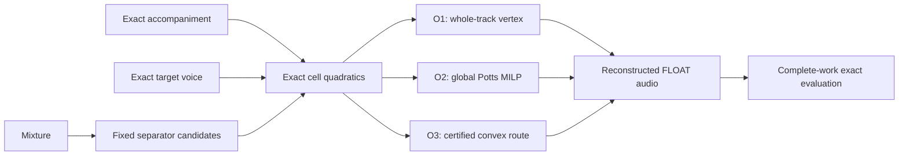

# Certified weighted routing envelope: theory, contracts, and executable claims

> **Scope:** exact-reference research diagnostic for `soloist_vs_rest`  
> **Implementation:** `audio_extract/oracle_routing_certified_v2.py`  
> **Status:** version-separated and unwired; the active `oracle-routing-v1-exploratory` runner is not yet a binding architecture gate

## 1. Question answered

Given a fixed set of separator accompaniment candidates

\[
Y_1,\ldots,Y_K,
\]

does a smooth, stereo-coherent local selection or convex mixture contain a materially better answer than every whole-track candidate?

The diagnostic is allowed to use exact accompaniment \(A\) and target soloist \(V\). It therefore measures an **oracle envelope**. It is not a deployable selector and never places clean references in the production path.



## 2. Exact cell model

For one time/frequency cell \(c\), let:

- \(a_c\in\mathbb C^N\): exact retained accompaniment;
- \(v_c\in\mathbb C^N\): exact target voice;
- \(y_{c,i}\in\mathbb C^N\): accompaniment candidate \(i\);
- \(w_c\in\Delta_K\): real nonnegative candidate weights summing to one.

When \([a_c,v_c]\) is identifiable, fit each candidate as

\[
y_{c,i}=\alpha_{c,i}a_c+\beta_{c,i}v_c+r_{c,i}.
\]

The fit uses one shared two-column complex ridge system for all candidates.

The intended errors are:

\[
\text{accompaniment transfer error}
=
\left|\sum_iw_{c,i}\alpha_{c,i}-1\right|^2,
\]

\[
\text{retained target voice}
=
\frac{E_{V,c}}{E_{A,c}+\epsilon}
\left|\sum_iw_{c,i}\beta_{c,i}\right|^2,
\]

\[
\text{orthogonal artifact}
=
\frac{1}{E_{A,c}+\epsilon}
\left\|\sum_iw_{c,i}r_{c,i}\right\|^2.
\]

Thus:

\[
d_c(w_c)=
\lambda_\alpha
\left|\alpha_c^\top w_c-1\right|^2
+
\lambda_\beta
\frac{E_{V,c}}{E_{A,c}+\epsilon}
\left|\beta_c^\top w_c\right|^2
+
\lambda_R
\frac{\left\|R_c^\top w_c\right\|^2}
{E_{A,c}+\epsilon}.
\]

The normalization terms do **not** depend on \(w_c\).

## 3. Quadratic form and convexity

For real \(w_c\):

\[
d_c(w_c)
=
w_c^\top Q_c w_c
-
2q_c^\top w_c
+
k_c,
\]

where:

\[
Q_c=
\lambda_\alpha
\operatorname{Re}
\left(\overline{\alpha_c}\alpha_c^\top\right)
+
\lambda_\beta
\frac{E_{V,c}}{E_{A,c}+\epsilon}
\operatorname{Re}
\left(\overline{\beta_c}\beta_c^\top\right)
+
\lambda_R
\frac{
\operatorname{Re}
\left(\overline{R_c}R_c^\top\right)
}{E_{A,c}+\epsilon},
\]

\[
q_c=\lambda_\alpha\operatorname{Re}(\alpha_c),
\qquad
k_c=\lambda_\alpha.
\]

Each matrix term is a Gram matrix restricted to real weights, hence is positive semidefinite:

\[
w^\top
\operatorname{Re}
(\overline z z^\top)
w
=
|z^\top w|^2
\ge 0,
\]

and:

\[
w^\top
\operatorname{Re}
(\overline R R^\top)
w
=
\|R^\top w\|^2
\ge0.
\]

Therefore \(Q_c\succeq0\), and the cell loss is convex.

### Why the exploratory objective was not sufficient

The exploratory objective included:

\[
\frac{|\beta(w)|^2E_V}
{|\alpha(w)|^2E_A+\epsilon}
\]

and the one-sided term:

\[
[1-|\alpha(w)|]_+^2.
\]

That objective is nonlinear in the denominator and can make accompaniment amplification reduce the voice ratio. It is useful as a heuristic existence search, but it is not a certified convex-hull envelope.

## 4. Exact fallback for unidentifiable cells

A cell is not discarded when:

- \(V\) is absent;
- \(A\) is absent;
- both are near silent;
- \([A,V]\) is ill-conditioned.

Define:

\[
e_{c,i}=y_{c,i}-a_c.
\]

Because \(w_c\in\Delta_K\):

\[
\sum_iw_{c,i}y_{c,i}-a_c
=
\sum_iw_{c,i}(y_{c,i}-a_c).
\]

Use:

\[
d_c^{\mathrm{direct}}(w_c)=
\lambda_d
\frac{
\left\|\sum_iw_{c,i}e_{c,i}\right\|^2
}{
\max(E_{A,c}+E_{V,c},E_{\mathrm{floor}})
}.
\]

This is another PSD quadratic. It gives meaningful supervision for:

```text
A active, V absent:
    preserve accompaniment

A absent, V active:
    accompaniment target is silence

A and V nearly silent:
    suppress routed noise

ill-conditioned A/V:
    match the exact accompaniment without unreliable attribution
```

Every exact cell has one declared mode:

```text
source_coordinates
no_vocal_direct_fallback
vocal_only_direct_fallback
silent_direct_fallback
ill_conditioned_direct_fallback
```

No nonempty exact cell becomes a clean-looking zero.

## 5. Explicit aggregation measure

Each cell has a strictly positive, identity-bearing measure \(\mu_c\).

The default helper uses:

\[
\mu_{t,b}
=
(\text{time extent})_t
(\text{frequency extent})_b.
\]

A runner may deliberately choose a different frozen measure, such as an ERB-band or event-aware measure, but it must record that policy.

Let:

\[
W=\sum_c\mu_c.
\]

The normalized data objective is:

\[
D(w)=
\frac1W
\sum_c
\mu_c d_c(w_c).
\]

For an adjacent edge \(e=(u,v)\), use:

\[
\mu_e=\frac{\mu_u+\mu_v}{2}.
\]

This prevents a short final time cell or a narrow frequency band from silently receiving the same mass as a much larger cell.

### Positive global scale invariance

Replace every cell measure with:

\[
\mu'_c=s\mu_c,\qquad s>0.
\]

Then \(W'=sW\), every edge measure becomes \(s\mu_e\), and all normalized data and smoothness terms are unchanged.

Therefore O1, O2, O3, and their normalized objective values are invariant to a positive global rescaling of the declared measure.

## 6. O1 contract

O1 chooses one candidate for the entire work:

\[
i^\star
=
\arg\min_i
\frac1W
\sum_c
\mu_c d_c(e_i).
\]

This is:

> the best whole-track vertex under the frozen exact local objective.

It is not automatically the production champion. The binding runner must also compare against the raw median champion, MDX fallback, and their analysis/synthesis identity controls.

## 7. O2 global Potts model

Let:

\[
x_{c,i}\in\{0,1\},
\qquad
\sum_i x_{c,i}=1.
\]

For edge \(e=(u,v)\), introduce:

\[
d_{e,i}\ge|x_{u,i}-x_{v,i}|.
\]

For one-hot labels:

\[
\frac12\sum_i d_{e,i}
=
\begin{cases}
0,&\text{same candidate},\\
1,&\text{different candidates}.
\end{cases}
\]

The exact O2 objective is:

\[
\frac1W
\sum_{c,i}
\mu_c d_c(e_i)x_{c,i}
+
\frac{\lambda_t}{2W}
\sum_{e\in E_t,i}
\mu_e d_{e,i}
+
\frac{\lambda_f}{2W}
\sum_{e\in E_f,i}
\mu_e d_{e,i}.
\]

This is a mixed-integer linear program.

A binding O2 result requires:

```text
finite incumbent
successful solver status
declared time limit
declared requested MIP gap
reported gap within the requested bound
objective recomputed from the returned labels
```

Small synthetic grids are exhaustively enumerated in tests to verify the factor-of-two encoding and global objective.

## 8. O3 weighted convex route

O3 solves:

\[
\min_{\{w_c\in\Delta_K\}}
D(w)
+
\frac{\lambda_t}{W}
\sum_{(u,v)\in E_t}
\mu_{uv}\|w_u-w_v\|^2
+
\frac{\lambda_f}{W}
\sum_{(u,v)\in E_f}
\mu_{uv}\|w_u-w_v\|^2.
\]

This is a convex quadratic over a product of simplices.

### Lipschitz bound

The data Hessian is block diagonal. A safe bound is:

\[
L_D
=
\max_c
\frac{2\mu_c}{W}
\lambda_{\max}(Q_c).
\]

Let the weighted graph degree of cell \(c\) be:

\[
d_c=
\lambda_t
\sum_{e\in E_t:c\in e}\mu_e
+
\lambda_f
\sum_{e\in E_f:c\in e}\mu_e.
\]

For a weighted graph Laplacian:

\[
\lambda_{\max}(L_G)\le2d_{\max}.
\]

The smoothness Hessian is \(2L_G/W\), hence:

\[
L_S\le\frac{4d_{\max}}W.
\]

Use:

\[
L=L_D+L_S.
\]

Projected gradient uses step \(1/L\).

### Convergence certificate

Define the projected-gradient mapping:

\[
G_L(w)
=
L
\left[
w-
\Pi_{\Delta}
\left(w-\frac1L\nabla F(w)\right)
\right].
\]

For a convex differentiable problem over the simplex product:

\[
G_L(w)=0
\]

is the first-order optimality condition.

The implementation rejects a result at the iteration limit unless:

\[
\|G_L(w)\|_2\le\tau.
\]

It also requires:

```text
monotone objective
simplex feasibility
finite values
agreement of independently initialized converged runs
```

A small seeded problem is independently solved by SLSQP and compared to the projected-gradient objective.

## 9. Scale-relative PSD handling

Floating-point Gram assembly can produce a tiny negative eigenvalue.

For matrix scale:

\[
s_Q=
\max(
\|Q\|_\infty,
\|Q\|_2,
|\operatorname{tr}Q|,
\text{tiny}
),
\]

the accepted numerical tolerance is:

\[
\tau_Q=\epsilon_{\mathrm{PSD}}s_Q.
\]

If:

\[
\lambda_{\min}(Q)<-\tau_Q,
\]

the cell is refused.

If:

\[
-\tau_Q\le\lambda_{\min}(Q)<0,
\]

a diagonal shift is applied and recorded. Validation uses the same relative policy.

## 10. Executable claim matrix

| Claim | Automated evidence |
|---|---|
| \(Q,c,k\) equal the direct complex source-coordinate loss | seeded random simplex identity tests |
| direct fallback equals exact target error | A-only, V-only, silent seeded identity tests |
| accompaniment amplification cannot game \(\alpha\) | adversarial amplification fixture |
| phase inversion is penalized | \(\alpha=-1\) fixture |
| every cell has one mode and positive measure | grid validation fixtures |
| O2 is globally correct | exhaustive enumeration on small weighted Potts grids |
| O3 reaches an independent optimum | weighted SLSQP comparison |
| projected-gradient result is certified | gradient-mapping threshold assertion |
| positive measure scaling is invariant | O1/O2/O3 rescaling test |
| numerical PSD repair is bounded | scaled repair/refusal fixtures |
| no-vocal and vocal-only regions influence selection | direct-fallback whole-track fixtures |

## 11. What this theory does not prove

It does not prove that:

- the candidate basis contains a production-quality accompaniment;
- the frozen cell resolution is fine enough for every operatic attack;
- STFT analysis/synthesis is perceptually transparent;
- a reference-free gate can infer the oracle route;
- the exact corpus represents every opera production;
- the chosen measure and loss weights match human preference.

Those are separate empirical gates.

## 12. Binding experimental controls still required

Before architecture selection, the runner must add:

```text
raw median champion
raw geometric median
raw uniform fusion
three single residuals
two untouched HTDemucs residuals
decoded-PCM deduplication
matching no-vocal outputs
O1 raw and O1 STFT identity
median raw and median STFT identity
2.0 / 1.0 / 0.5 second frozen resolution comparison
artifact, transient, stereo, hall, seam, and worst-event gates
```

A large certified O2/O3 gain supports a frozen-member gate. A small certified gain plus common failure cells supports a new pretrained family or target-singer-conditioned correction model.
