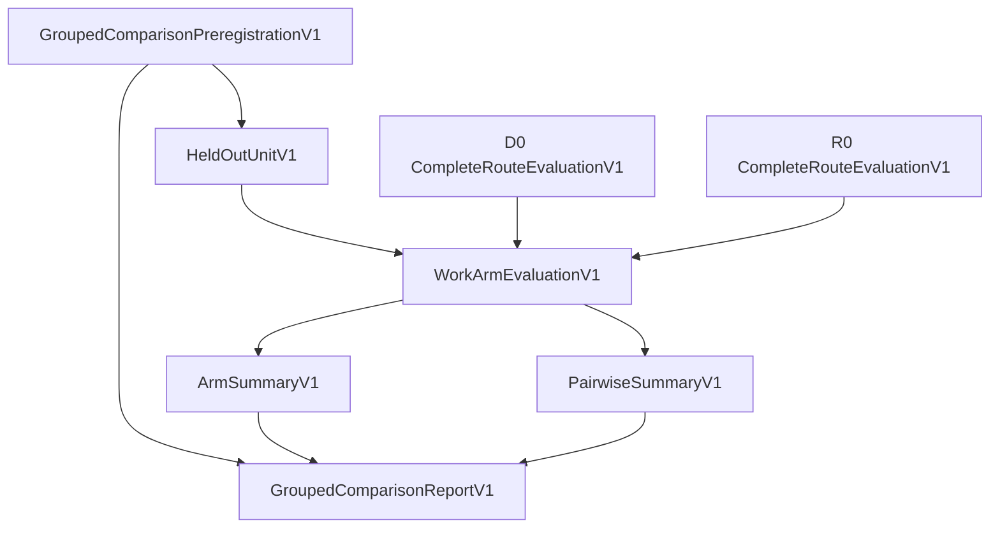

# D0/R0 grouped held-out comparison v1

> **Separate artifact branch:** `bigoracle/d0-r0-grouped-comparison-artifacts-20260810`  
> **Parent research lane:** PR #23, `bigoracle/counterfactual-risk-router-v0-20260809`  
> **Status:** dormant CPU-only evaluation machinery; no training, audio render, model promotion, or production selector change

## Purpose

The first learned-routing study compares two frozen, equal-compute arms:

```text
D0 — imitate the route produced by the frozen structured oracle
R0 — predict every candidate × defect counterfactual risk,
     calibrate upper risks, and use the same frozen Potts decoder
```

This artifact creates the final non-promoting report that joins the existing
per-work `CompleteRouteEvaluationV1` records.

It answers:

- Did each arm return a route or abstain?
- Was a returned route exact-safe?
- Did it create a catastrophic false safe?
- Was required secondary evidence missing?
- What was its complete-route exact regret when safe?
- How much temporal/frequency switching did it use?
- Where both arms were safe, which had lower regret?

It deliberately does **not** select a winner or authorize promotion. A separate,
prewritten promotion policy must consume the completed report later.

## Binding graph



## Preregistration binds

- exact dataset, split, and held-out subset;
- exact-evidence manifest;
- ordered candidate panel;
- feature and metric contracts;
- routing policy;
- complete-route evaluator contract;
- comparison policy;
- separate future promotion policy;
- one equal compute budget;
- one equal checkpoint rule;
- D0 and R0 artifact/run identities;
- canonical held-out units;
- source commit;
- paired-regret tie tolerance.

## Each held-out unit binds

- work;
- recording session;
- target singer;
- source-family certificate;
- query condition;
- query-quality stratum;
- exact evidence;
- exact risk panel;
- exact routing preflight;
- exact oracle decision.

This prevents an evaluation from being moved to another work or query while
retaining the same arm-level report.

## One source family, one vote

V1 requires every held-out unit to carry a unique `source_family_sha256`.
That prevents nominal test size from being inflated by multiple crops,
resolutions, query variants, remixes, transforms, or aliases from one source.

A future version may permit multiple required scenes inside one family, but it
must first freeze a family-level reduction. V1 uses the simplest auditable rule:
one registered complete-route unit per source family.

## Outcome semantics

Per arm, every unit is exactly one of:

```text
ROUTE_SAFE
ROUTE_CATASTROPHIC_FALSE_SAFE
ROUTE_INCOMPLETE_REQUIRED_EVIDENCE
ABSTAIN
ORACLE_UNAVAILABLE
```

Only `ROUTE_SAFE` contributes a finite selection-regret value. Catastrophic,
incomplete, abstaining, and oracle-unavailable outcomes are never averaged as
zero regret.

## Aggregate outputs

### Per arm

- oracle availability;
- submitted-route coverage;
- safe-route coverage;
- catastrophic false-safe count;
- incomplete-evidence count;
- abstention count/rate;
- critical and secondary violation counts;
- mean, median, and worst safe regret;
- worst-safe-regret unit identity;
- mean temporal and frequency switches on safe routes.

### Paired

- both-route and both-safe coverage;
- D0-safe-only and R0-safe-only counts;
- catastrophic cross-arm counts;
- R0-lower-regret, D0-lower-regret, and tie counts on both-safe units;
- mean/median/min/max `R0 - D0` exact regret;
- mean switching differences;
- complete status cross-tabulation.

The tie tolerance affects only win/tie classification. It does not alter the
actual regret values.

## Fail-closed checks

The implementation rejects:

- missing, duplicate, or additional arm/unit records;
- noncanonical unit or result ordering;
- repeated source families;
- unequal compute budgets or checkpoint rules;
- source-commit drift;
- dataset, split, test-subset, panel, feature, metric, policy, or preregistration drift;
- an arm result bound to another arm run;
- an evaluation whose exact evidence differs from its held-out unit;
- D0 and R0 using different exact evidence or oracle facts;
- one arm claiming oracle availability when the other does not;
- summary mutation;
- a promotion decision inside the report.

## Report contract

```text
schema: audio-extract/d0-r0-grouped-comparison-report/v1
status: COMPLETE_NO_PROMOTION_DECISION
promotion_decision: null
```

The report is evidence for a later decision, never the decision itself.

## Focused validation before upload

The implementation/test artifact was exercised in an isolated package containing
the repository's complete-route-evaluation and group-identity contracts:

```text
14 passed
```

This is focused artifact validation, not a complete-repository exact-head claim.
The stacked draft PR must receive repository-wide validation before integration
into PR #23.

## Next step

1. Review this separate branch independently of PR #23's large research surface.
2. Integrate only after exact-head focused and complete repository tests pass.
3. Freeze the real D0/R0 preregistration and held-out-unit registry.
4. Produce one complete-route evaluation per arm per unit.
5. Generate this report.
6. Apply a separately versioned promotion policy after independent verification.

No GPU training or audio render is authorized by this artifact.
