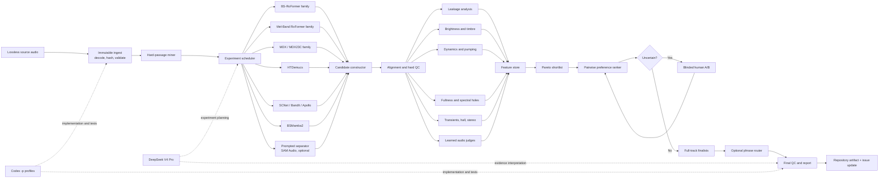
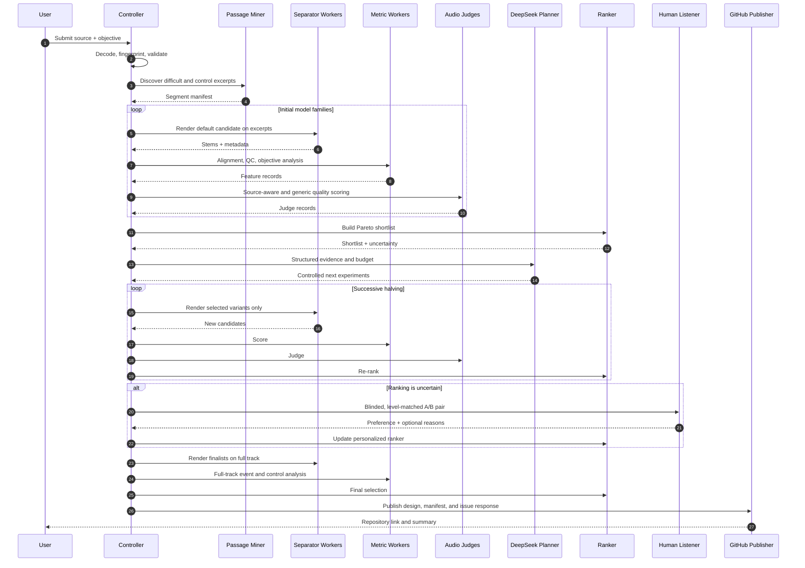
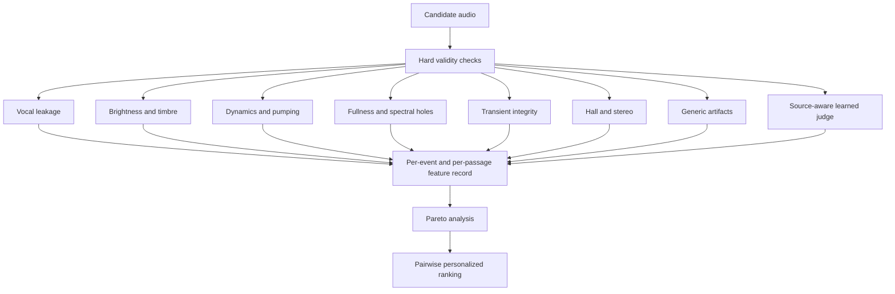
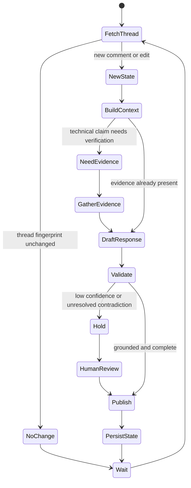
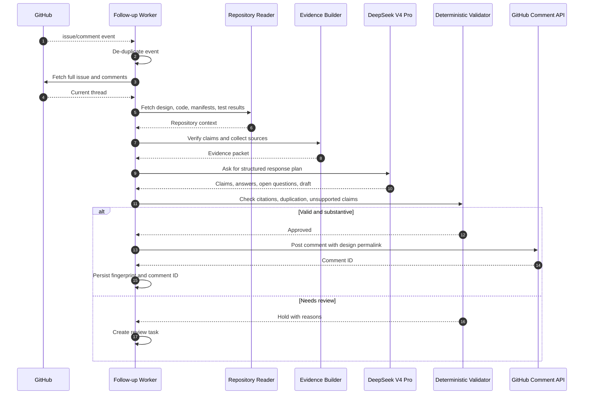
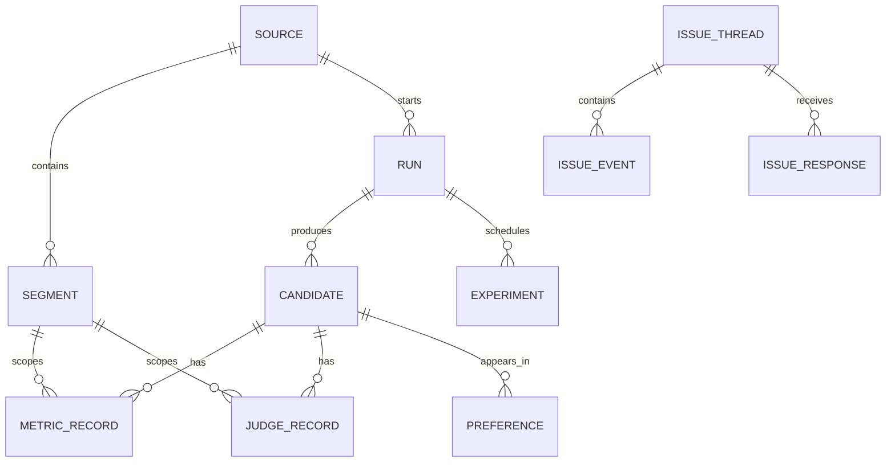

# Audio Separation Automation & Perceptual Quality Evaluation

> **Design artifact for `mickg10/audio-extract` — Issue #1**  
> **Status:** Proposed architecture  
> **Version:** 0.9  
> **Date:** 2026-08-04  
> **Primary use case:** Produce stable, natural instrumental backing tracks from difficult vocal-plus-orchestra recordings, especially opera, while preserving dynamics, brightness, hall ambience, transients, and stereo image.

---

## Executive decision

The system should not bet on one separator, one score, or one general-purpose language model.

It should operate as an **experiment-and-ranking pipeline**:

1. A diverse bank of source-separation models generates candidate stems.
2. Deterministic audio analysis measures distinct failure modes.
3. Audio-native learned judges assess perceptual quality and source faithfulness.
4. A calibrated pairwise ranker combines those signals.
5. Human listening is reserved for close or uncertain decisions.
6. DeepSeek V4 Pro plans experiments and explains evidence.
7. Codex implements, tests, and maintains the repository.
8. GitHub issue follow-up is event-driven, idempotent, and able to publish this design as a repository artifact.

The system must preserve a distinction between:

- a **mixture-consistent residual**;
- an attempted **restored accompaniment**; and
- a **production-ready backing track**.

Those are related outputs, but they are not the same signal and should not be presented as though they were.

---

## 1. Goals and non-goals

### Goals

- Remove the singer with minimal audible leakage.
- Avoid orchestral “ducking,” “pumping,” and momentary spectral holes under loud vocal notes.
- Preserve high-string and brass brightness without rewarding harshness or residual vocal harmonics.
- Preserve hall reverberation, stereo width, attacks, decays, and natural dynamics.
- Support several modern separation architectures through one adapter interface.
- Search model/configuration space efficiently rather than exhaustively.
- Produce auditable results with model hashes, settings, metrics, and lineage.
- Learn the owner’s real preference from blinded A/B comparisons.
- Use DeepSeek V4 Pro for structured planning and reporting.
- Use Codex profiles for repeatable implementation and test workflows.
- Publish a polished Markdown report and maintain a thoughtful GitHub issue conversation.

### Non-goals

- Claim recovery of the literal pre-master orchestra from an arbitrary commercial stereo master.
- Let a text-only LLM directly decide which waveform sounds best.
- Maximize a single metric such as SDR, spectral centroid, or vocal-removal strength.
- Automatically chain every available cleanup model.
- Run every checkpoint at every overlap and segment setting.
- Replace final human listening on high-value material.

---

## 2. Define the target before optimizing it

Let the released mixture be:

\[
X = V + A
\]

where \(V\) is the vocal contribution and \(A\) is the accompaniment under a simplified linear model.

### 2.1 Mixture-consistent residual

Given a vocal estimate \(\hat V\):

\[
\hat A_{\text{residual}} = X - \hat V
\]

This construction has an exact algebraic property:

\[
\hat A_{\text{residual}} + \hat V = X
\]

That is useful for implementation verification. It does **not** prove that \(\hat A_{\text{residual}}\) equals the true accompaniment. If \(\hat V\) contains violin harmonics, brass, room reflections, or orchestral transients, those elements are removed from the residual.

### 2.2 Native predicted instrumental

Some models estimate the instrumental directly:

\[
\hat A_{\text{native}} = f_A(X)
\]

This can sound fuller than a subtraction residual because the model predicts the target independently. However, independently predicted stems may not sum exactly to the mixture.

### 2.3 Restored or counterfactual accompaniment

A mastered recording may include:

- equalization;
- bus compression;
- saturation;
- limiting;
- reverberation;
- codec effects;
- interactions between sources inside nonlinear processing.

The desired clean accompaniment can therefore be closer to:

\[
A_{\text{clean}} \approx g^{-1}(X, \hat V, \text{context})
\]

where \(g\) is an unknown production process. This is a **music source restoration** problem, not merely ordinary separation.

### 2.4 Production backing track

The production backing is the most useful listening output. It may combine:

- the best direct instrumental;
- a mixture-consistent residual;
- a conservative ensemble;
- phrase-level patches;
- a narrowly targeted restoration step.

The deliverables should make the distinction explicit:

```text
faithful_residual.wav
native_instrumental.wav
production_backing.wav
vocal_estimate.wav
analysis-report.html
run-manifest.json
```

---

## 3. System architecture



### Architectural rule

The language-model layer never receives a bare instruction such as:

> “Listen to these twenty WAV files and choose the best.”

Instead, it receives structured measurements, model metadata, event tags, human preference history, and allowed next actions.

---

## 4. End-to-end run lifecycle



---

## 5. Repository layout

```text
audio-extract/
├── AGENTS.md
├── pyproject.toml
├── README.md
├── docs/
│   ├── audio-separation-automation-design.md
│   ├── model-catalog.md
│   ├── metric-specification.md
│   └── listening-protocol.md
├── configs/
│   ├── models/
│   ├── metrics/
│   ├── judges/
│   ├── experiments/
│   └── profiles/
├── src/audio_extract/
│   ├── ingest/
│   ├── segments/
│   ├── separators/
│   │   ├── base.py
│   │   ├── msst.py
│   │   ├── uvr.py
│   │   ├── demucs.py
│   │   └── sam_audio.py
│   ├── candidates/
│   │   ├── residual.py
│   │   ├── native.py
│   │   ├── stem_sum.py
│   │   └── ensemble.py
│   ├── alignment/
│   ├── metrics/
│   │   ├── leakage.py
│   │   ├── dynamics.py
│   │   ├── brightness.py
│   │   ├── fullness.py
│   │   ├── transients.py
│   │   ├── reverb.py
│   │   ├── stereo.py
│   │   └── artifacts.py
│   ├── judges/
│   │   ├── sam_audio_judge.py
│   │   ├── audiobox_aesthetics.py
│   │   └── instruction_judge.py
│   ├── ranking/
│   │   ├── pareto.py
│   │   ├── bradley_terry.py
│   │   ├── active_learning.py
│   │   └── phrase_router.py
│   ├── orchestration/
│   │   ├── controller.py
│   │   ├── scheduler.py
│   │   ├── budget.py
│   │   └── deepseek_planner.py
│   ├── github_followup/
│   │   ├── issue_reader.py
│   │   ├── responder.py
│   │   ├── state.py
│   │   └── publisher.py
│   └── reports/
├── tests/
│   ├── unit/
│   ├── synthetic_audio/
│   ├── metamorphic/
│   ├── integration/
│   └── golden/
└── runs/
    └── <source-sha256>/
        ├── manifest.sqlite
        ├── candidates/
        ├── features.parquet
        ├── preferences.parquet
        ├── report.html
        └── run-manifest.json
```

---

## 6. Immutable ingest and provenance

The input stage should:

- decode to floating-point PCM;
- retain original sample rate and channel count;
- never normalize before separation;
- keep an immutable source copy;
- avoid lossy intermediates;
- calculate SHA-256;
- record decoder version and command;
- identify duration, channels, sample rate, bit depth, and stream layout;
- detect truncated or malformed input;
- record true peak and DC offset without altering the audio.

### Candidate identity

A candidate must be content-addressed:

\[
\text{candidate\_id} =
\mathrm{SHA256}(
\text{source hash}
\parallel
\text{checkpoint hash}
\parallel
\text{normalized config}
\parallel
\text{code commit}
\parallel
\text{construction}
)
\]

This prevents a configuration from silently changing while retaining the same label.

### Minimum lineage record

```json
{
  "candidate_id": "sha256:...",
  "source_id": "sha256:...",
  "model": {
    "family": "bs_roformer",
    "checkpoint_name": "BS-RoFormer-Viperx-1297",
    "checkpoint_sha256": "sha256:...",
    "implementation": "msst",
    "implementation_commit": "..."
  },
  "inference": {
    "segment_samples": 352800,
    "overlap_mode": "integer_factor",
    "overlap_value": 4,
    "batch_size": 1,
    "tta": false,
    "denoise": false,
    "compensation": 1.0
  },
  "construction": "mixture_minus_vocal",
  "created_at": "2026-08-04T00:00:00Z"
}
```

---

## 7. Discover the difficult passages first

Full-track grid searches are expensive and often misleading because most of the program may be easy.

The passage miner should deliberately find:

- loud soprano attacks;
- highest estimated vocal pitch;
- high vocal-to-accompaniment ratio;
- dense orchestral tuttis;
- brass and high-string overlap;
- singer onset and offset boundaries;
- phrase endings with long hall tails;
- quiet accompaniment beneath sustained voice;
- instrumental-only controls;
- randomly selected controls.

### Feature sources for passage mining

A cheap provisional separator can provide:

- vocal probability;
- estimated vocal energy;
- vocal onset/offset;
- provisional vocal pitch;
- provisional accompaniment density.

The original mixture can provide:

- short-time loudness;
- spectral flux;
- crest factor;
- multiband energy;
- stereo activity;
- estimated reverberant decay.

### Recommended excerpt set

For one work:

| Segment class | Count | Typical length |
|---|---:|---:|
| Extreme vocal notes | 4–8 | 8–20 s |
| Dense overlap / tutti | 4–8 | 8–20 s |
| Vocal offset + hall tail | 3–5 | 10–25 s |
| Quiet accompaniment under voice | 2–4 | 8–20 s |
| Instrumental controls | 3–5 | 10–30 s |
| Random controls | 2–4 | 10–30 s |

The passage manifest must include a small pre-roll and post-roll so chunk boundaries and reverberant tails are not evaluated in isolation.

---

## 8. Separation model bank

The model bank should maximize **error diversity**, not model count.

### 8.1 Recommended families

| Family | Domain / mechanism | Why it belongs | Typical caution |
|---|---|---|---|
| **BS-RoFormer** | Complex spectrogram, heuristic non-overlapping bands, time/band Transformers | Strong established vocal/instrumental baseline | Checkpoint quality matters more than family name alone |
| **Mel-Band RoFormer** | Complex spectrogram, overlapping mel bands, time/band Transformers | Different frequency allocation; often strong for vocals | Can trade bass behavior or fullness differently |
| **BS PolarFormer / newer BS variants** | Community and research extensions of band-split Transformer models | Useful high-quality challenger | Validate implementation, checkpoint provenance, and license |
| **MDX-Net / MDX23C** | Spectrogram U-Net / TFC-TDF-style families | Different artifact profile from RoFormer | Can create characteristic spectral holes or leakage |
| **HTDemucs** | Hybrid waveform and spectrogram processing | Complementary phase, attack, and transient behavior | May sound diffuse or fuzzy on difficult material |
| **SCNet** | Sparse/compressed spectrogram modeling | Efficient and architecturally distinct | Quality depends strongly on checkpoint and stem target |
| **BandIt / Apollo / Conformer variants** | Bandwise sequence modeling with distinct backbones | Adds useful model diversity | Do not assume paper-family results transfer to every checkpoint |
| **BSMamba2** | Band splitting plus long-sequence state-space blocks | Experimental long-context challenger | Newer ecosystem; validate stability and memory behavior |
| **SAM Audio** | Prompt-conditioned general audio separation | Useful for unusual target prompts and comparison | Not automatically superior to music-specialist models |
| **Open-Unmix / Spleeter** | Older reproducible baselines | Fast sanity controls | Normally not finalists for demanding opera material |

### 8.2 Initial production bank

A practical first run should include:

1. BS-RoFormer Viperx-1297
2. One newer high-fullness BS-RoFormer or BS PolarFormer checkpoint
3. Mel-Band RoFormer Kimberley Jensen or another well-documented vocal checkpoint
4. MDX23C or a strong UVR instrumental checkpoint
5. HTDemucs
6. SCNet
7. BSMamba2 as an experimental challenger
8. SAM Audio as an optional prompted comparison

Do not begin with twenty near-duplicate RoFormer checkpoints.

### 8.3 Evidence policy

Use three evidence layers:

1. **Academic papers** for architectural claims and benchmark methodology.
2. **Current checkpoint catalogs and leaderboards** for practical candidate discovery.
3. **Community reports** for hypotheses about difficult genres and settings.

Community reports are useful, especially where users repeatedly observe that no single model wins on every song. They should trigger controlled tests, not become universal defaults.

---

## 9. Candidate construction

Each separator may produce several candidates.

### 9.1 Native instrumental

Use the model’s directly predicted instrumental output where available.

### 9.2 Mixture-minus-vocal residual

\[
\hat A_{\text{residual}} = X - \hat V
\]

This should be generated whenever a reliable vocal estimate exists.

### 9.3 Sum of non-vocal stems

For a multi-stem model:

\[
\hat A_{\text{sum}}
=
\hat S_{\text{drums}}
+
\hat S_{\text{bass}}
+
\hat S_{\text{other}}
+
\hat S_{\text{piano}}
+
\hat S_{\text{guitar}}
+\cdots
\]

This must be sample-aligned before summing.

### 9.4 Ensembles

Potential ensemble operators:

- weighted time-domain mean;
- robust median;
- weighted spectral mean;
- conservative spectral minimum;
- frequency-dependent weighted mean.

Spectral maximum should not be the default because a large magnitude in one model can represent either useful signal or leakage/artifact.

A weighted time-domain ensemble is:

\[
\hat A_{\text{ens}}(t)
=
\frac{\sum_i w_i \hat A_i(t)}
{\sum_i w_i}
\]

Before averaging:

- align to sub-sample precision where necessary;
- estimate fixed gain differences;
- confirm channel ordering;
- check polarity;
- reject candidates with incompatible timing.

### 9.5 Spectral inversion

Treat UVR spectral inversion as a candidate transform, not as a guarantee of recovering untouched accompaniment. Ordinary waveform subtraction and UVR spectral inversion are not equivalent operations.

---

## 10. Normalize overlap semantics

Interfaces use two incompatible overlap conventions.

### Fractional overlap

\[
\mathrm{hop} = (1-o)\cdot \mathrm{chunk}
\]

| Fraction | Approximate repeated processing |
|---:|---:|
| 0.25 | 1.33× |
| 0.50 | 2× |
| 0.75 | 4× |
| 0.99 | 100× |

### Integer overlap factor

\[
\mathrm{hop} = \frac{\mathrm{chunk}}{n}
\]

| Factor | Effective overlap |
|---:|---:|
| 2 | 50% |
| 4 | 75% |
| 8 | 87.5% |

The experiment schema should store both:

```json
{
  "overlap_mode": "integer_factor",
  "overlap_value": 4,
  "effective_fraction": 0.75
}
```

### Automated sweep

For integer controls:

```text
2 → 4 → 8
```

For fractional controls:

```text
0.25 → 0.50 → 0.75
```

Stop when seam metrics and listening results plateau. Maximum overlap can smooth chunk transitions; it cannot reliably fix source-assignment errors that occur inside every chunk.

---

## 11. Alignment and hard technical QC

No perceptual score is meaningful until the candidates are aligned and technically valid.

### Reject or repair

- wrong duration;
- wrong sample rate;
- wrong channel count;
- sample offset;
- model latency;
- swapped channels;
- unexpected silence;
- NaN or infinite values;
- clipping;
- large DC offset;
- periodic seam clicks;
- truncated endings;
- unplanned normalization;
- stereo collapse;
- accidental resampling.

### Alignment

Estimate integer and fractional delay using:

- cross-correlation over instrumental controls;
- phase slope in stable bands;
- known model latency where documented.

Record the correction; never silently modify without lineage.

### Mixture consistency

\[
E_{\text{recon}}
=
\frac{
\left\|X-\sum_s\hat S_s\right\|_2
}{
\left\|X\right\|_2+\epsilon
}
\]

Use this to catch implementation problems. Do not use it as the principal listening-quality score.

---

## 12. Quality evaluation stack



The system should preserve all axis scores. It should not collapse them to a single number until late in the ranking process.

---

## 13. Vocal leakage

Use several complementary indicators:

- source-aware judge precision;
- singing-voice detector on the instrumental;
- energy aligned to consensus vocal events;
- harmonic salience around estimated vocal \(F_0\);
- weak phoneme or speech evidence;
- comparison with a consensus vocal stem.

### Event-aligned leakage score

For candidate \(c\) and vocal event \(e\):

\[
L_{c,e}
=
\frac{
\sum_{t\in e} p_{\text{voice}}(t)\,E_c(t)
}{
\sum_{t\in e}E_c(t)+\epsilon
}
\]

This is only one feature. High strings or solo woodwinds can resemble voice to a classifier, so the score must be interpreted alongside source-aware judging and controls.

---

## 14. Brightness and timbre fidelity

Brightness should be **measured relative to an expected orchestral spectrum**, not maximized.

A candidate can appear bright because of:

- preserved violins and brass;
- residual soprano harmonics;
- musical noise;
- high-frequency ringing;
- an artificial high shelf.

### 14.1 Feature group

Calculate at the original sample rate:

- spectral centroid;
- log-frequency centroid;
- spectral slope;
- spectral rolloff at 85%, 90%, and 95%;
- psychoacoustic sharpness;
- ERB-band or mel-band spectral envelope;
- energy ratios for 2–4, 4–8, 8–12, and 12–20 kHz;
- high-frequency transient energy;
- high-frequency stereo width;
- temporal distributions, not only global means.

### 14.2 Instrumental control passages

Where the original contains no voice, use the mix as the local orchestral reference:

\[
\Delta B_c(t) = B_c(t) - B_X(t)
\]

### 14.3 Vocal passages

Do not compare candidate centroid directly with mixture centroid, because the singer changes the mixture spectrum.

Construct the expected orchestral envelope from:

- pre- and post-vocal context;
- architecture-diverse candidate consensus;
- similar instrumental passages;
- synthetic mixtures with known stems;
- human-calibrated preferences.

### 14.4 Brightness-fidelity score

\[
Q_{\text{bright}}(c)
=
-\left[
w_1|\Delta C|
+
w_2|\Delta S|
+
w_3|\Delta R|
+
w_4D_{\text{ERB}}
+
w_5|\Delta H_{\text{stereo}}|
\right]
\]

where:

- \(\Delta C\) is centroid deviation;
- \(\Delta S\) is slope deviation;
- \(\Delta R\) is rolloff deviation;
- \(D_{\text{ERB}}\) is the distance between expected and candidate auditory-band envelopes;
- \(\Delta H_{\text{stereo}}\) is high-frequency width deviation.

No term rewards brightness merely for being brighter.

---

## 15. Pumping and volume-hole detection

The audible “pumping” commonly attributed to a separator is often a time-varying source-assignment error.

Suppose:

\[
\hat V = V + \varepsilon
\]

where \(\varepsilon\) is orchestral energy mistakenly assigned to the vocal. Then:

\[
\hat A_{\text{residual}}
=
X-\hat V
=
A-\varepsilon
\]

As \(\varepsilon\) grows during a loud high note, the accompaniment develops a temporary hole.

### 15.1 Vocal-event map

Identify:

- onset;
- peak;
- offset;
- pitch;
- vocal energy;
- phrase identity;
- hall-tail interval.

### 15.2 Multiband envelopes

Calculate 50–250 ms envelopes in bands such as:

```text
20–120 Hz
120–500 Hz
500 Hz–2 kHz
2–5 kHz
5–10 kHz
10–20 kHz
```

Also calculate short-time perceptual loudness.

### 15.3 Expected accompaniment envelope

Combine:

- smooth local interpolation;
- robust median across diverse candidates;
- model of no-vocal orchestral context;
- known synthetic ground truth.

### 15.4 Event dip

\[
\mathrm{dip}_{c,e,b}
=
\max_t
\left[
E_{\text{expected},e,b}(t)
-
E_{c,e,b}(t)
\right]_+
\]

Record:

- maximum dip depth;
- dip duration;
- attack speed;
- recovery time;
- affected bands;
- correlation with vocal energy;
- uniqueness to that candidate;
- continuation into the reverberant tail.

### 15.5 Candidate pumping score

Use a robust statistic over the worst events rather than a track average:

\[
Q_{\text{pump}}(c)
=
-\operatorname{median}
\left(
\operatorname{TopK}_{e,b}
\left[
\mathrm{dip}_{c,e,b}
+
\alpha\,\mathrm{duration}_{c,e,b}
\right]
\right)
\]

This proposed metric must be calibrated on human-labeled examples.

---

## 16. Fullness and spectral-hole analysis

A candidate can suppress the singer but remove orchestra with her.

Measure:

- deviation from architecture-diverse consensus;
- narrowband and broadband energy deficits;
- continuity of partials across the vocal event;
- local spectral-envelope curvature;
- missing onset energy;
- source-aware judge recall and faithfulness.

A simple hole detector can compare candidate \(c\) with a robust expected log spectrum:

\[
H_c(t,f)
=
\left[
\log E_{\text{expected}}(t,f)
-
\log E_c(t,f)
-\tau
\right]_+
\]

Aggregate by:

- contiguous area;
- depth;
- duration;
- frequency span;
- alignment to vocal peaks.

---

## 17. Transients, hall, stereo, and generic artifacts

### Transient integrity

- spectral flux;
- onset slope;
- crest factor;
- multiband attack time;
- high-frequency attack preservation;
- transient timing displacement.

### Hall reverberation

At vocal offsets, measure:

- late-tail energy;
- decay slope;
- spectral decay by band;
- discontinuities;
- left/right coherence;
- whether the tail is over-removed with the singer.

### Stereo image

- mid/side ratio;
- interchannel coherence;
- phase correlation;
- bandwise width;
- image-center drift;
- high-frequency width.

### Generic artifacts

- narrow repetitive modulation;
- tonal musical noise;
- isolated spectral spikes;
- periodic chunk seams;
- crackles;
- unnatural modulation spectrum;
- codec-like smearing.

---

## 18. Learned audio judges

### 18.1 SAM Audio Judge

SAM Audio Judge is especially relevant because it evaluates a candidate against:

- the source mixture;
- the separated output;
- a target description.

Its dimensions are:

- recall;
- precision;
- faithfulness;
- overall quality.

Suggested passes:

```text
Target: "orchestral accompaniment without the operatic soprano"
Candidate: instrumental
```

and:

```text
Target: "operatic soprano singing"
Candidate: vocal stem
```

The second pass catches candidates that seem full only because voice remains in the instrumental.

### 18.2 Audiobox Aesthetics

Use Production Quality as a secondary, source-agnostic signal for:

- clarity;
- natural dynamics;
- frequency balance;
- spatialization;
- obvious technical artifacts.

Do not let a generic aesthetics score override leakage or source-faithfulness evidence.

### 18.3 Instruction-driven audio judge

A Jastin-like model can answer pairwise questions such as:

> Which candidate better preserves natural high-string brightness while avoiding residual soprano and metallic artifacts?

Use it experimentally with:

- A/B and B/A order reversal;
- prompt paraphrases;
- repeated trials;
- calibration examples;
- uncertainty tracking.

### 18.4 Text-only LLMs

DeepSeek V4 Pro does not replace an audio front end. It should never be told that it has heard a waveform when it has only received text, JSON, or numeric features.

---

## 19. Two analysis copies per candidate

### Raw copy

- no normalization;
- no limiting;
- no compression;
- used for dynamics, pumping, clipping, reconstruction, and envelope analysis.

### Level-matched listening copy

- one fixed global gain;
- no per-window gain changes;
- no limiter;
- used for A/B listening and learned perceptual judges.

This prevents loudness from dominating preference.

---

## 20. Ranking strategy

### 20.1 Hard rejection gates

Reject candidates with:

- technical invalidity;
- severe clipping;
- large timing mismatch;
- gross vocal leakage;
- catastrophic spectral holes;
- periodic seam artifacts;
- stereo collapse;
- severe hall-tail truncation.

### 20.2 Pareto frontier

Candidate \(A\) dominates \(B\) only when \(A\) is no worse on all important axes and better on at least one.

Preserve alternatives such as:

- least leakage;
- best fullness;
- most stable dynamics;
- most faithful brightness;
- best hall and stereo;
- best overall learned-judge result.

### 20.3 Personalized pairwise ranker

Start with a Bradley–Terry/logistic model:

\[
P(A>B)
=
\sigma\left(
w^\top(f_A-f_B)
\right)
\]

where \(f_A\) and \(f_B\) are candidate feature vectors.

Advantages:

- interpretable;
- data-efficient;
- easy to retrain;
- uncertainty-aware;
- personalized.

Initially omit model names from the feature vector so the ranker learns audio properties rather than checkpoint reputation.

### 20.4 Active learning

Request human comparisons where:

\[
P(A>B)\approx 0.5
\]

The listening UI should:

- hide model names;
- randomize order;
- level-match;
- loop the difficult phrase;
- include “no meaningful difference”;
- occasionally repeat a pair to measure consistency;
- permit separate leakage, pumping, fullness, brightness, and artifact judgments.

---

## 21. Phrase-level routing

Use one principal candidate for most of the track. Patch only isolated failures.

For phrase \(t\) and candidate \(c_t\):

\[
\arg\max_{c_1,\ldots,c_T}
\sum_t Q(c_t,t)
-
\lambda \sum_t \mathbf{1}[c_t\ne c_{t-1}]
-
\mu \sum_t M(c_t,c_{t-1},t)
\]

where:

- \(Q\) is local quality;
- \(\lambda\) penalizes switching;
- \(M\) penalizes level, timbre, phase, and stereo mismatch at the transition.

Solve with dynamic programming.

Switch only:

- at phrase boundaries or low-energy points;
- between aligned candidates;
- when the quality gain clears a threshold;
- with a short auditioned crossfade;
- with hysteresis to prevent rapid alternation.

---

## 22. Successive-halving experiment plan

A full grid grows too quickly:

```text
7 models
× 2 constructions
× 3 overlap levels
× 2 denoise choices
× 2 TTA choices
= 168 candidates
```

Use a funnel.

### Stage 1 — Architecture screen

- 6–8 model families;
- default configuration;
- no ensemble;
- no TTA;
- difficult excerpts only.

Keep approximately three or four.

### Stage 2 — Construction and overlap

For finalists:

- native instrumental;
- mixture-minus-vocal residual;
- non-vocal stem sum where applicable;
- two or three reasonable overlap values.

Keep two to four candidate variants.

### Stage 3 — Full-track render

Render only finalists and repeat all event/control analyses.

### Stage 4 — Ensemble and restoration

Test only:

- one or two evidence-based weighted ensembles;
- a targeted restoration step for a diagnosed defect;
- phrase patches for isolated failures.

---

## 23. DeepSeek V4 Pro integration

### Role

DeepSeek V4 Pro should:

- interpret structured measurements;
- identify conflicts between metrics;
- propose one-variable experiments;
- manage compute budget;
- choose useful human A/B pairs;
- identify missing evidence;
- write technical summaries;
- update the design rationale.

It should not:

- claim to hear audio;
- choose arbitrary shell commands;
- invent model availability;
- post unvalidated comments;
- bypass the deterministic controller.

### Current API placement

Use DeepSeek V4 Pro through Chat Completions. As of this document’s date, DeepSeek’s official documentation says its Responses API supports V4 Flash while V4 Pro support is still pending. Codex integration through DeepSeek therefore uses V4 Flash unless that documentation changes.

### Planner input

```json
{
  "run_id": "run_...",
  "objective": {
    "primary": "stable production backing",
    "constraints": [
      "minimal soprano leakage",
      "preserve brightness",
      "preserve hall tail",
      "avoid event-correlated volume holes"
    ]
  },
  "budget": {
    "gpu_minutes_remaining": 180,
    "max_new_candidates": 12,
    "max_full_track_renders": 3
  },
  "segments": [
    {
      "id": "seg_004",
      "tags": ["soprano_forte", "brass_overlap", "hall_tail"]
    }
  ],
  "candidates": [
    {
      "id": "cand_001",
      "family": "bs_roformer",
      "construction": "native_instrumental",
      "metrics": {
        "leakage": 0.11,
        "pump_depth_db": 0.8,
        "brightness_deviation": 0.22,
        "spectral_hole_score": 0.08,
        "judge_precision": 0.84,
        "judge_recall": 0.79,
        "judge_faithfulness": 0.81
      }
    }
  ],
  "allowed_actions": [
    "change_overlap",
    "change_construction",
    "enable_tta",
    "create_weighted_average",
    "request_human_pair",
    "render_full_track"
  ]
}
```

### Planner output

```json
{
  "shortlist": ["cand_001", "cand_007"],
  "rejected": {
    "cand_003": ["vocal leakage exceeds gate"]
  },
  "next_experiments": [
    {
      "parent_candidate_id": "cand_001",
      "action": "change_overlap",
      "parameters": {"overlap_factor": 8},
      "reason": "Candidate is strong except for localized seam score."
    }
  ],
  "human_comparisons": [
    ["cand_001", "cand_007"]
  ],
  "warnings": [
    "Brightness preference is unresolved because the generic judge used a reduced-bandwidth front end."
  ]
}
```

### Minimal validated client

```python
from __future__ import annotations

import json
import os
import time
from typing import Any

from openai import OpenAI
from pydantic import BaseModel, Field, ValidationError


class ProposedExperiment(BaseModel):
    parent_candidate_id: str
    action: str
    parameters: dict[str, Any] = Field(default_factory=dict)
    reason: str


class SeparationPlan(BaseModel):
    shortlist: list[str]
    rejected: dict[str, list[str]]
    next_experiments: list[ProposedExperiment]
    human_comparisons: list[list[str]]
    warnings: list[str]


client = OpenAI(
    api_key=os.environ["DEEPSEEK_API_KEY"],
    base_url="https://api.deepseek.com",
)


SYSTEM_PROMPT = """
You are an audio-separation experiment planner.

You cannot hear audio. Use only the supplied measurements, configurations,
human labels, and documented constraints. Do not invent acoustic properties.

Return JSON matching the supplied schema. Prefer controlled one-variable
experiments. Use only actions from the allowlist. Respect the compute budget.
"""


def create_plan(report: dict[str, Any]) -> SeparationPlan:
    last_error: Exception | None = None

    for attempt in range(3):
        response = client.chat.completions.create(
            model="deepseek-v4-pro",
            messages=[
                {"role": "system", "content": SYSTEM_PROMPT},
                {
                    "role": "user",
                    "content": "Return JSON.\n"
                    + json.dumps(report, separators=(",", ":")),
                },
            ],
            response_format={"type": "json_object"},
            reasoning_effort="high",
            extra_body={"thinking": {"type": "enabled"}},
            max_tokens=5000,
        )

        content = response.choices[0].message.content or ""

        try:
            if not content.strip():
                raise ValueError("DeepSeek returned empty content")
            return SeparationPlan.model_validate_json(content)
        except (ValidationError, ValueError) as exc:
            last_error = exc
            time.sleep(2 ** attempt)

    raise RuntimeError(f"Invalid planner response: {last_error}")
```

The controller must validate every proposed action and reject duplicate or out-of-range experiments.

---

## 24. Codex `-p` integration

The Codex `-p` / `--profile` option overlays:

```text
$CODEX_HOME/<profile-name>.config.toml
```

on the base configuration.

Use Codex for:

- separator adapters;
- metrics;
- synthetic tests;
- manifests and caching;
- listening UI;
- report generation;
- issue-follow-up implementation;
- refactoring;
- unit and integration tests;
- pull-request preparation.

Do not use Codex as the acoustic judge.

### Development profile

`~/.codex/audio-lab-dev.config.toml`

```toml
# Inherit the verified Codex model from ~/.codex/config.toml.
# Pin `model = "..."` here only after confirming the catalog name.
model_reasoning_effort = "high"
approval_policy = "on-request"
sandbox_mode = "workspace-write"
```

### Automated implementation profile

`~/.codex/audio-lab-ci.config.toml`

```toml
# Inherit the verified Codex model from ~/.codex/config.toml.
# Pin `model = "..."` here only after confirming the catalog name.
model_reasoning_effort = "high"
approval_policy = "never"
sandbox_mode = "workspace-write"
```

### Non-interactive invocation

```bash
codex exec \
  -p audio-lab-ci \
  --sandbox workspace-write \
  --ephemeral \
  --json \
  -C /path/to/audio-extract \
  "Implement the next unchecked task in docs/audio-separation-automation-design.md.
   Run relevant unit and integration tests.
   Do not modify inputs/original/.
   Do not replace checkpoint files.
   Do not create lossy audio intermediates.
   Record changed files and test results."
```

### Repository instructions

Add an `AGENTS.md`:

```markdown
# Repository working agreement

- Preserve original audio bit depth, sample rate, and channel count unless a
  conversion is explicitly part of a test.
- Never normalize source audio before separation.
- New metrics require synthetic monotonicity tests.
- Separator adapters must emit complete lineage metadata.
- Run unit tests and the short synthetic integration suite after changes.
- Do not select a winner from model name or benchmark rank alone.
- Keep GitHub issue responses grounded in repository state and measured results.
```

---

## 25. GitHub issue follow-up automation

A chat response cannot remain alive indefinitely. The durable solution is an event-driven worker plus a periodic reconciliation job.

### Objectives

- Read the complete issue and all comments.
- Track the last processed event.
- Ignore the bot’s own comments.
- Detect edits as well as new comments.
- Build a grounded response from:
  - issue text;
  - comment history;
  - repository files;
  - run results;
  - academic references;
  - the current design artifact.
- Post at most one response for each new conversational state.
- Publish the Markdown design in the repository and link it from the issue.
- Avoid repetitive “acknowledged” comments.
- Answer technical objections directly and preserve unresolved questions.

### Recommended publication method

GitHub issue-comment APIs do not provide a universal “attach this arbitrary local file” operation comparable to dragging a file into the web UI. The reliable automated method is:

1. Commit this file to:

   ```text
   docs/audio-separation-automation-design.md
   ```

2. Use a permalink to that commit in the issue reply.
3. Optionally include a concise summary in the comment.
4. Update the document in later commits while preserving links to prior versions.

### Event model

Use both:

- `issue_comment` and `issues` webhooks for prompt response;
- a scheduled reconciliation job to recover missed events.



### Thread fingerprint

```text
thread_fingerprint =
SHA256(
    issue updated_at
    + issue body hash
    + ordered comment IDs
    + ordered comment updated_at values
    + relevant repository commit
)
```

A response record should contain:

```json
{
  "repository": "mickg10/audio-extract",
  "issue_number": 1,
  "thread_fingerprint": "sha256:...",
  "last_seen_comment_id": 123,
  "last_seen_comment_updated_at": "2026-08-04T00:00:00Z",
  "posted_comment_id": 456,
  "design_commit": "abc123...",
  "status": "posted"
}
```

### Comment response sequence



### Response policy

The responder should:

- quote only the minimum needed to identify the point;
- answer every substantive claim;
- separate measured facts, inferences, and proposals;
- correct itself explicitly when new evidence changes a conclusion;
- avoid model-brand arguments;
- ask for a reproducible audio excerpt when a claim cannot be adjudicated from text;
- avoid posting when the new comment is only thanks, an emoji, or a duplicate;
- consolidate several rapid comments into one coherent response;
- wait briefly for comment bursts before replying;
- never create a reply loop with itself or another bot.

### Reconciliation loop pseudocode

```python
def reconcile_issue(repo: str, issue_number: int) -> None:
    thread = github.fetch_issue_thread(repo, issue_number)
    fingerprint = fingerprint_thread(thread)

    state = store.load(repo, issue_number)

    if state and state.thread_fingerprint == fingerprint:
        return

    new_events = diff_thread(state, thread)
    if not contains_substantive_human_change(new_events):
        store.save_seen(repo, issue_number, fingerprint, thread)
        return

    repo_context = repository_context(repo)
    evidence = build_evidence_packet(thread, repo_context)

    plan = deepseek.plan_issue_response(
        thread=thread,
        evidence=evidence,
        design_path="docs/audio-separation-automation-design.md",
    )

    validated = validate_issue_response(
        plan=plan,
        thread=thread,
        evidence=evidence,
        max_length=25_000,
    )

    if validated.requires_review:
        review_queue.enqueue(validated)
        return

    comment_id = github.post_issue_comment(
        repo=repo,
        issue_number=issue_number,
        body=validated.markdown,
    )

    store.save_posted(
        repo=repo,
        issue_number=issue_number,
        thread_fingerprint=fingerprint,
        posted_comment_id=comment_id,
        thread=thread,
    )
```

### Scheduling

Preferred:

- webhook-driven immediate run;
- 10–30 minute scheduled reconciliation;
- exponential backoff for transient API failures;
- a per-issue lock;
- a maximum response frequency;
- batching of comments arriving within a short window.

---

## 26. Data model

### Core tables



### Suggested storage

- SQLite or PostgreSQL for run state and issue state.
- Parquet for dense frame/event measurements.
- JSON for immutable manifests.
- Object storage or filesystem for WAV files.
- HTML for human-readable reports.

---

## 27. Synthetic benchmark and metric validation

Commercial masters do not provide ground-truth accompaniment. Build an opera-oriented synthetic benchmark from legally usable:

- solo vocal stems;
- orchestral stems;
- choir stems;
- hall impulse responses;
- dry and reverberant material.

Vary:

- vocal-to-orchestra ratio;
- soprano pitch and intensity;
- orchestral density;
- brass/string overlap;
- hall decay;
- stereo width;
- EQ;
- compression;
- limiting;
- saturation;
- codec;
- sample rate;
- noise.

### Controlled corruptions

Inject known defects into a clean backing:

- vocal leakage;
- 1–6 dB dips synchronized to the singer;
- high-shelf cuts and boosts;
- narrow spectral holes;
- metallic modulation;
- reverb-tail truncation;
- stereo narrowing;
- channel delay;
- clipped attacks.

### Metamorphic tests

The metrics must move monotonically:

- more pumping → worse pumping score;
- more leakage → worse leakage score;
- larger high-shelf loss → larger brightness deviation;
- more tail truncation → worse hall score;
- narrower stereo → worse width-preservation score.

A metric that fails these tests cannot be trusted in ranking.

---

## 28. Test strategy

### Unit tests

- manifest hashing;
- overlap normalization;
- residual construction;
- alignment;
- metric invariants;
- DeepSeek schema validation;
- issue fingerprinting;
- duplicate-response prevention.

### Synthetic audio tests

- pure tones;
- chirps;
- harmonic stacks;
- transient trains;
- stereo decorrelation;
- known gain dips;
- known delays;
- known spectral shelves.

### Golden tests

Store small legal fixtures and expected ranges rather than exact floating-point output where GPU determinism is not guaranteed.

### Integration tests

- one short source through two separator adapters;
- full candidate lineage;
- metric extraction;
- pairwise ranker update;
- report generation;
- dry-run issue response;
- publication to a test repository.

### Operational checks

- idempotent retries;
- interrupted job recovery;
- bounded disk use;
- bounded GPU queue;
- API failure handling;
- stale lock recovery;
- correct behavior when an issue is closed or locked.

---

## 29. Reporting

Every run should generate:

### Executive summary

- selected candidate;
- principal alternatives;
- strongest and weakest passages;
- unresolved uncertainty;
- whether phrase patching was used.

### Candidate table

| Candidate | Leakage | Pumping | Brightness fidelity | Fullness | Hall/stereo | Learned judge | Human preference |
|---|---:|---:|---:|---:|---:|---:|---:|

### Event report

For each hard passage:

- waveform and loudness envelope;
- multiband dip chart;
- spectral-envelope comparison;
- vocal event timing;
- candidate ranking;
- audio links.

### Provenance appendix

- input hash;
- checkpoint hashes;
- source code commit;
- settings;
- environment;
- candidate lineage;
- DeepSeek planner requests/responses;
- human labels;
- final selection rationale.

---

## 30. Recommended implementation phases

### Phase 0 — Publish and baseline

- Add this document under `docs/`.
- Add `AGENTS.md`.
- Add immutable ingest and manifest schema.
- Add Viperx and one non-RoFormer adapter.
- Add residual and native constructions.
- Add short excerpt runner.

### Phase 1 — Objective QC

- Alignment.
- Hard validity gates.
- Vocal-event map.
- Pumping metric.
- Brightness feature group.
- Leakage and fullness metrics.
- HTML report.

### Phase 2 — Model bank and ranking

- Add Mel-Band RoFormer, MDX23C, HTDemucs, and SCNet.
- Add Pareto frontier.
- Add blinded A/B interface.
- Add Bradley–Terry ranker.
- Add active-learning pair selection.

### Phase 3 — Learned judges

- Add SAM Audio Judge.
- Add generic Production Quality judge.
- Add experimental instruction-driven pairwise judge.
- Calibrate all learned scores against human labels.

### Phase 4 — Planner and automation

- Add DeepSeek V4 Pro structured planner.
- Add experiment budget.
- Add successive halving.
- Add Codex profiles and non-interactive test workflows.

### Phase 5 — Full production

- Add full-track rendering.
- Add phrase router.
- Add targeted restoration experiments.
- Add issue follow-up worker.
- Add scheduled reconciliation and repository report publication.

---

## 31. Initial acceptance criteria

The first production milestone is successful when it can:

1. Ingest a stereo lossless recording without alteration.
2. Mine at least ten difficult/control excerpts.
3. Run at least five architecturally diverse separator candidates.
4. Generate native and residual constructions.
5. Detect alignment, clipping, silence, and channel errors.
6. Report event-aligned pumping and brightness-fidelity measurements.
7. Run a source-aware judge.
8. Produce a Pareto shortlist.
9. Request a blinded comparison for uncertain finalists.
10. Render the selected full-track candidate.
11. Generate a complete Markdown/HTML report.
12. Commit the design artifact and post one idempotent issue update.
13. Resume correctly after interruption without duplicating work or comments.

---

## 32. Key conclusions

- **BS-RoFormer-Viperx-1297 is a strong baseline, not an absolute universal winner.**
- **Apparent volume pumping is usually source-assignment error, not a literal compressor clamp.**
- **Overlap primarily addresses chunk transitions; it does not guarantee stable accompaniment.**
- **Brightness must be judged as fidelity, not magnitude.**
- **Spectral inversion does not promise untouched original orchestra.**
- **The best automated judge is a stack of direct measurements, source-aware audio models, generic production-quality models, and calibrated human preference.**
- **DeepSeek V4 Pro belongs at the planning and explanation layer.**
- **Codex belongs at the implementation and test layer.**
- **A durable GitHub follow-up loop must be event-driven and stateful; a single chat turn cannot remain alive indefinitely.**
- **The design should be committed to the repository and linked from Issue #1 rather than depending on an ephemeral attachment.**

---

## References

### Academic and primary technical sources

1. Lu, Wang, Kong, and Hung, **Music Source Separation with Band-Split RoPE Transformer**  
   <https://arxiv.org/abs/2309.02612>

2. Wang, Lu, and Won, **Mel-Band RoFormer for Music Source Separation**  
   <https://arxiv.org/abs/2310.01809>

3. ZFTurbo, **Music-Source-Separation-Training (MSST)**  
   <https://github.com/ZFTurbo/Music-Source-Separation-Training>

4. **Music-Source-Separation-Training: A Unified Framework for Music Source Separation**  
   <https://arxiv.org/abs/2607.23395>

5. **Music Source Restoration with Ensemble Separation and Targeted Reconstruction**  
   <https://arxiv.org/abs/2603.16926>

6. **SAM Audio: Segment Anything in Audio**  
   <https://arxiv.org/abs/2512.18099>

7. **SAM Audio Judge: A Unified Multimodal Framework for Perceptual Evaluation of Audio Separation**  
   <https://arxiv.org/abs/2601.19702>

8. Meta, **SAM Audio Judge model card**  
   <https://huggingface.co/facebook/sam-audio-judge>

9. **Meta Audiobox Aesthetics: Unified Automatic Quality Assessment for Speech, Music, and Sound**  
   <https://arxiv.org/abs/2502.05139>

10. **Jastin: Aligning LLMs for Zero-Shot Audio and Speech Evaluation**  
    <https://arxiv.org/abs/2605.04505>

### DeepSeek and Codex documentation

11. DeepSeek API, **Your First API Call**  
    <https://api-docs.deepseek.com/>

12. DeepSeek API, **JSON Output**  
    <https://api-docs.deepseek.com/guides/json_mode/>

13. DeepSeek API, **Thinking Mode**  
    <https://api-docs.deepseek.com/guides/thinking_mode/>

14. DeepSeek API, **Responses API**  
    <https://api-docs.deepseek.com/guides/responses_api/>

15. OpenAI, **Codex Developer Commands**  
    <https://developers.openai.com/codex/developer-commands>

16. OpenAI, **Codex Advanced Configuration — Profiles**  
    <https://developers.openai.com/codex/config-file/config-advanced>

17. OpenAI, **Codex Non-interactive Mode**  
    <https://developers.openai.com/codex/non-interactive-mode>

18. OpenAI, **Custom Instructions with AGENTS.md**  
    <https://developers.openai.com/codex/agent-configuration/agents-md>

### Community evidence

19. Reddit discussion emphasizing that no one separator wins on every song and describing practical BS-RoFormer/MDX/Demucs experimentation:  
    <https://www.reddit.com/r/audioengineering/comments/184e9kk/which_is_actually_the_best_vocal_remover_of_all/>

Community settings are treated as experiment suggestions, not as authoritative defaults.

---

*End of design artifact.*
