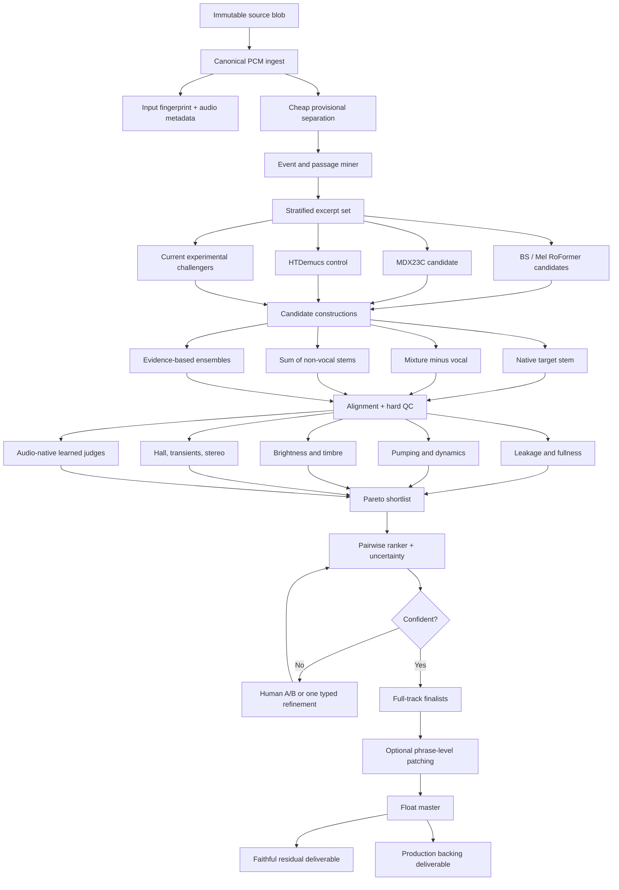
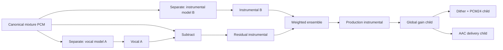
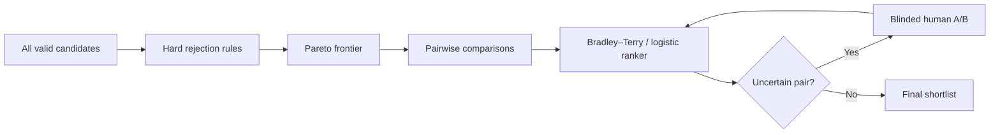
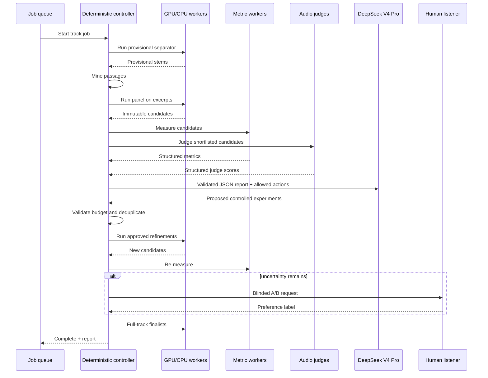

# audio-extract v2 design

> **Volume-stable operatic instrumental extraction**  
> Design response for [`mickg10/audio-extract` issue #1](https://github.com/mickg10/audio-extract/issues/1), anchored to commit [`2a9a42b7744e4473768985939dcc37fa471aa874`](https://github.com/mickg10/audio-extract/commit/2a9a42b7744e4473768985939dcc37fa471aa874).  
> Prepared as an implementable specification, not a model-ranking memo.

---

## Executive decision

The proposed v2 shape is correct:

- deterministic audio tools do all decoding, separation, alignment, measurement, ranking inputs, rendering, and caching;
- a bounded conductor interprets structured evidence and may request a small number of typed experiments;
- the queue remains the authoritative lifecycle;
- candidates are immutable, content-addressed DAG nodes;
- difficult excerpts are screened before full-track renders;
- model choice is empirical and per recording, not hardcoded.

Four v1 semantics should be corrected **before** building the scaffold:

1. `original - estimated_vocal` is a **waveform residual**, not UVR “spectral inversion.” It is mixture-consistent, but it does not leave the orchestra untouched:
   \[
   \hat V = V - L + T
   \quad\Longrightarrow\quad
   \hat A = M-\hat V = A + L - T
   \]
   Here \(L\) is missed vocal material and \(T\) is orchestral material mistakenly placed in the vocal estimate. \(T\) becomes the audible “hole” or apparent pumping.

2. A 24-bit PCM write after floating-point processing is **quantized**, not lossless. A global gain operation is reversible while retained in float; conversion to PCM24 is not bit-exactly reversible.

3. Candidate audio must never be normalized or otherwise rewritten in place. Normalization, dither, and delivery encoding are child transforms with their own IDs.

4. The present wrapper silently resamples through `librosa.load(..., sr=44100)`, truncates alignment to the shorter length, and—through current `audio-separator` defaults—can apply normalization and an integer write path before v2 sees the stems. Those behaviors must be made explicit or bypassed.

---

## System map



---

# 1. Candidate identity and canonical configuration

## 1.1 Use three identities, not one overloaded hash

A single string should not be asked to mean both “same logical recipe” and “same emitted bytes.”

| Identity | Meaning | Use |
|---|---|---|
| `recipe_id` | Canonical description of the requested computation | cache lookup, DAG parentage |
| `artifact_pcm_sha256` | Hash of the canonical decoded output samples | verifies actual audio bytes independently of container metadata |
| `execution_fingerprint` | Runtime facts that may explain nondeterminism | audit, reproducibility diagnostics |

Recommended formulas:

```text
recipe_id =
  SHA256("audio-extract-recipe-v2\0" + RFC8785_JCS(recipe_object))

artifact_pcm_sha256 =
  SHA256(
    little_endian_float32_interleaved_pcm
    + sample_rate_u32
    + channel_layout_descriptor
    + frame_count_u64
  )
```

Also retain:

- `source_blob_sha256`: the uploaded MP3/WAV/FLAC bytes;
- `input_pcm_sha256`: the canonical decoded PCM used by the graph;
- `container_sha256`: optional hash of the emitted WAV file, which may differ because of metadata while decoded PCM is identical.

RFC 8785 JCS supplies deterministic JSON property ordering and primitive serialization. Apply **schema normalization first**, then JCS.

## 1.2 Schema normalization rules

Before canonical serialization:

1. Materialize every effective default. Omitted overlap and explicitly supplied default overlap must produce the same recipe.
2. Reject `NaN`, `Infinity`, duplicate keys, unknown enum values, and unrecognized fields.
3. Represent quantities with exact application semantics:
   - sample counts and rates as integers;
   - overlap as an integer factor where the adapter uses one;
   - dB values as integer micro-dB or normalized decimal strings;
   - time spans as integer samples, not binary floats;
   - booleans as booleans, never `"yes"` / `"no"`.
4. Sort sets before storing them; preserve sequence order where order changes the computation.
5. Replace local paths with portable identifiers and hashes.
6. Normalize model names only for display. Identity comes from weight hash, configuration hash, adapter revision, and target semantics.
7. Include the **effective** model configuration after all wrapper defaults have been resolved.
8. Include the resampler, filter preset, sample rates, and channel transform whenever resampling or channel conversion occurs.
9. Record numeric precision and inference mode (`float32`, `float16`, autocast, deterministic mode).
10. Version the canonicalization discipline itself.

## 1.3 Recommended recipe object

```json
{
  "schema": "audio-extract/recipe/v2",
  "canon": "rfc8785+jcs-schema-v1",
  "input_pcm": {
    "sha256": "…",
    "sample_rate_hz": 44100,
    "channel_layout": ["FL", "FR"],
    "frames": 5644800,
    "sample_format": "float32-le-interleaved"
  },
  "operation": {
    "type": "separate",
    "target": "vocals",
    "construction": "native_primary"
  },
  "model": {
    "model_id": "viperx-1297",
    "weights_sha256": "5b84f37e8d444c8cb30c79d77f613a41c05868ff9c9ac6c7049c00aefae115aa",
    "config_sha256": "…",
    "adapter": "audio-separator-mdxc",
    "adapter_revision": "audio-separator-0.44.5+audio-extract-adapter-v1"
  },
  "effective_config": {
    "model_sample_rate_hz": 44100,
    "segment_samples": 352800,
    "overlap_factor": 8,
    "batch_size": 1,
    "pitch_shift_semitones": 0,
    "input_peak_normalization": "disabled",
    "output_peak_normalization": "disabled",
    "output_sample_format": "float32"
  },
  "software": {
    "audio_extract_commit": "2a9a42b7744e4473768985939dcc37fa471aa874",
    "torch": "…",
    "numpy": "…",
    "librosa": "…"
  }
}
```

## 1.4 Output construction is a first-class DAG node

Yes: average, maximum, native mask output, subtraction, cleanup, normalization, and delivery encoding require distinct IDs. Do not hide them in a text description.



Suggested operation types:

```text
decode
resample
channel_map
separate
mixture_minus_source
sum_stems
waveform_ensemble
spectral_ensemble
cleanup
global_gain
phrase_route
dither_quantize
encode_delivery
measure
judge
```

Normalization target and sample type belong in `global_gain` / `dither_quantize`, **not** in a separator candidate’s ID.

## 1.5 Runtime details

Keep hardware, CUDA, MPS, CPU, and driver details in `execution_fingerprint`. Promote them into `recipe_id` only when the cache policy demands bitwise-identical execution. In practice:

- `recipe_id` answers “did we request the same computation?”;
- `artifact_pcm_sha256` answers “did it emit the same PCM?”;
- the execution record explains differences.

## 1.6 Immutable storage

Recommended layout:

```text
lib/<track_id>/
  source/
    source.json
    original.<ext>
    canonical.f32.wav
  passages/
    passages.v1.json
  candidates/
    <recipe_id>/
      recipe.json
      execution.json
      output.f32.wav
      output.pcm.sha256
      metrics.json
  renders/
    <recipe_id>/
      delivery.wav
      delivery.m4a
  manifest.sqlite
```

Candidates are append-only. A changed result creates a new node; no stage edits a parent WAV.

---

# 2. Passage miner

## 2.1 Do not begin with speech VAD

A conventional speech VAD is not the right primary detector for operatic singing. The provisional vocal stem already simplifies the problem. Start with a transparent fusion of:

- provisional vocal energy;
- pitch confidence and continuity;
- vocal harmonicity;
- optional singing-voice activity probability;
- mixture/accompaniment density;
- phrase transitions and reverberant tails.

Recommended initial pitch stack:

1. **PESTO** as the main low-cost tracker;
2. **pYIN** as a deterministic fallback and disagreement signal;
3. optional **torchcrepe/CREPE** on selected excerpts for a higher-cost cross-check.

PESTO is lightweight and explicitly evaluated for singing voice and musical-instrument pitch. Do not trust any single tracker around vibrato, orchestral bleed, or octave errors; store confidence and continuity.

## 2.2 Frame configuration

```text
analysis frame:        40 ms
analysis hop:          10 ms
pitch median filter:   100–150 ms
activity close gap:    <= 120 ms
minimum active event:  150 ms
default window:        12 s
allowed window range:  8–20 s
pre/post context:      at least 2 s each when available
```

## 2.3 Activity score

For each frame, compute:

- provisional vocal RMS and perceptual loudness;
- pitch confidence;
- harmonic-to-noise proxy;
- spectral crest / harmonic salience;
- robust track-local vocal noise floor.

Initial active-vocal rule:

```text
active =
  (
    vocal_level_db >= max(noise_floor_db + 10 dB, vocal_level_p35)
    and pitch_confidence >= 0.55
  )
  or vocal_level_db >= vocal_level_p85
```

Apply hysteresis:

```text
on threshold:  activity_score >= 0.60
off threshold: activity_score <= 0.35
```

These are seed thresholds, not universal truth. Persist the raw features so they can be recalibrated without re-separating.

## 2.4 “High soprano” definition

Use both an absolute and track-relative criterion:

```text
high_soprano =
  median_voiced_f0 >= 523.25 Hz  # C5
  or median_voiced_f0 >= track_voiced_f0_p80

extreme_soprano =
  peak_smoothed_f0 >= 698.46 Hz  # F5
  or peak_smoothed_f0 >= track_voiced_f0_p95
```

Require:

- at least 250 ms of voiced confidence above threshold;
- continuity checks to reject isolated octave jumps;
- a maximum plausible jump rate unless an onset boundary is present.

For mezzo, tenor, chorus, and mixed ensembles, the percentile branch prevents an overly soprano-specific miner.

## 2.5 Vocal-to-accompaniment ratio

After placing the provisional stems in a common gain convention:

\[
\mathrm{VAR}_{dB}(t)=10\log_{10}
\frac{P_{\hat V}(t)+\epsilon}{P_{\hat A}(t)+\epsilon}
\]

Seed categories:

| Category | VAR |
|---|---:|
| accompaniment-dominant overlap | `< -9 dB` |
| balanced overlap | `-9 to -3 dB` |
| vocal-dominant | `-3 to +3 dB` |
| exposed vocal / quiet backing | `> +3 dB` |

Do not rank models by this provisional separation; use it only to select varied tests.

## 2.6 Dense accompaniment / “tutti” proxy

The system cannot reliably infer “tutti” from energy alone. Name the machine feature **dense accompaniment** and combine:

- accompaniment short-time loudness ≥ track p80;
- occupied ERB/log-frequency bands ≥ p70;
- spectral flux or onset density ≥ p70;
- low silence probability;
- optional polyphonic pitch-count / chroma activity.

A segment qualifies when at least three of four conditions hold for ≥500 ms.

## 2.7 Hall-tail events

Detect a vocal offset where:

1. activity falls from `>0.60` to `<0.20`;
2. mixture or provisional vocal-tail energy remains above its local floor;
3. the following 0.25–3.0 s contains decaying, spectrally coherent energy.

Store:

- pre-offset vocal level;
- tail duration estimate;
- decay slope in several bands;
- accompaniment activity during the tail.

## 2.8 Avoid clustered windows

Use a two-stage selector.

### Stage A: event proposal and suppression

- center a 12 s window on each event;
- expand up to 20 s to preserve a phrase ending or hall tail;
- snap edges toward low-energy boundaries within ±1.5 s;
- apply interval non-maximum suppression:
  - maximum IoU `0.25`;
  - minimum center separation `8 s`;
  - maximum two windows from the same detected phrase.

### Stage B: stratified diversity

Meet category quotas, then use farthest-point selection over standardized features:

```text
median F0
peak F0
vocal/accompaniment ratio
accompaniment loudness
band occupancy
spectral flux
tail decay
stereo width
track position
```

Recommended per work:

| Group | Count |
|---|---:|
| hard vocal overlaps | 8–12 |
| hall tails | 3–5 |
| no-vocal controls | 3–5 |
| random controls | 2–4 |

Every selected passage record contains its features, detector versions, time bounds, and selection reason.

## 2.9 Miner pseudocode

```python
events = detect_vocal_events(provisional_vocal)
proposals = []

for event in events:
    features = summarize_event(event, mix, provisional_vocal, provisional_inst)
    tags = classify(features)
    proposals.append(make_window(event, tags, min_s=8, default_s=12, max_s=20))

proposals = interval_nms(
    proposals,
    max_iou=0.25,
    min_center_distance_s=8.0,
    max_per_phrase=2,
)

selected = stratified_farthest_point_select(
    proposals,
    quotas={
        "high_soprano": 3,
        "dense_overlap": 3,
        "quiet_backing": 2,
        "entrance_exit": 2,
        "hall_tail": 4,
        "no_vocal_control": 4,
        "random_control": 3,
    },
)
```

---

# 3. Seed model panel

## 3.1 Selection principle

The panel should maximize **error diversity and provenance quality**, not checkpoint count. Architecture name is not enough; every row is a specific weight/config/adapter bundle.

A practical first screen is 6–8 bundles. Current leaderboards are useful for discovery, but they are not operatic evaluations and do not measure this project’s exact “no holes, natural hall, low bleed” objective.

## 3.2 Tier A: stable baseline panel

The following weight hashes are SHA-256 values published in the linked model repositories or their LFS pointers.

| ID | Checkpoint | Primary use | SHA-256 | Source / notes |
|---|---|---|---|---|
| `viperx_1297` | `model_bs_roformer_ep_317_sdr_12.9755.ckpt` | established vocal baseline; also inspect native secondary | `5b84f37e8d444c8cb30c79d77f613a41c05868ff9c9ac6c7049c00aefae115aa` | [MSST config](https://github.com/ZFTurbo/Music-Source-Separation-Training/blob/main/configs/viperx/model_bs_roformer_ep_317_sdr_12.9755.yaml); [public model release](https://github.com/TRvlvr/model_repo/releases/tag/all_public_uvr_models) |
| `kim_vocal_2` | `MelBandRoformer.ckpt` / registry alias `vocals_mel_band_roformer.ckpt` | high-quality vocal estimate for residual construction | `87201f4d31afb5bc79993230fc49446918425574db48c01c405e44f365c7559e` | [KimberleyJSN source](https://huggingface.co/KimberleyJSN/melbandroformer/tree/94a0e5de2622a4160198b158e6f8141296da887e); single-target vocal |
| `unwa_inst_v1e_plus` | `inst_v1e_plus.ckpt` / registry alias `melband_roformer_inst_v1e_plus.ckpt` | instrumental-fullness candidate | `6a4ddba739f0352407fb6e18b29206b82318ec427fe37fcedb0f83241e4e15fb` | [pcunwa source, pinned commit](https://huggingface.co/pcunwa/Mel-Band-Roformer-Inst/tree/f86cd9e99d63eb9499b00fca424bc4ed8a8aeaba) |
| `becruily_inst` | `mel_band_roformer_instrumental_becruily.ckpt` | independent instrumental candidate | `a8da6632a1c25efb1c9be783ce9ea367d226d4b918cd6c3717c8b1d7a396041d` | [becruily source, pinned commit](https://huggingface.co/becruily/mel-band-roformer-instrumental/tree/1bbef428121cc700899a57c8a50d6dce13aa7e98) |
| `becruily_vocal` | `mel_band_roformer_vocals_becruily.ckpt` | second vocal-family estimate for residual ensemble | `a05961310cc55fbb901290c2e8be02682942f73522b6ac76bf2ec11e347ed95a` | [becruily vocal source](https://huggingface.co/becruily/mel-band-roformer-vocals/tree/af457f56e56eb23fa8322929eef6a63b455e5858) |
| `mdx23c_hq` | `MDX23C-8KFFT-InstVoc_HQ.ckpt` | architecture-diverse TFC/TDF candidate | `49d51472769e34a2501cd1da782346a3212555c3a5619fc2c53507445528d816` | UVR public model bundle; pin downloaded bytes by this hash |
| `bs_polarformer` | `model_bs_polarformer_float16.ckpt` | compact current vocal-family challenger | `fc8b72c3beb92caad4e14f180979c02ddf18a330182176cf6c7bb0eb6c685e87` | [official MSST v1.0.20 release](https://github.com/ZFTurbo/Music-Source-Separation-Training/releases/tag/v1.0.20) |
| `htdemucs_ft` | `htdemucs_ft.yaml` plus four official `.th` weights | waveform/hybrid-domain control | import-time bundle hash | [official Demucs release files referenced by MSST](https://github.com/ZFTurbo/Music-Source-Separation-Training/blob/main/docs/pretrained_models.md) |

For `htdemucs_ft`, compute a **bundle hash** over the canonical descriptor plus the full SHA-256 of all four weight files. A YAML filename alone is not a model identity.

## 3.3 Tier B: current challengers

These are worth testing after the base harness works, but some require their accompanying implementation file rather than a stock `audio-separator` adapter.

| ID | Checkpoint | SHA-256 | Comment |
|---|---|---|---|
| `hyperace_v2_inst` | `bs_roformer_inst_hyperacev2.ckpt` | `4d61178ef966d2b4e9ad456ffbbc6fd5b2828df07a7af32931142c1a5ff1fe6f` | current instrumental challenger; pin model code and config too |
| `hyperace_v2_voc` | `bs_roformer_voc_hyperacev2.ckpt` | `54cf516f621f2f460bf660ed137e244b8931bf7a2ce85ddceecff816dbc4d668` | matching vocal challenger |
| `bs_inst_fno` | `bs_roformer_fno.ckpt` | `f35bf6d87b2863372388e85c2d9679e5b7651e5c2ddd23aab1480f7af10b90ca` | custom FNO variant; custom adapter |
| `resurrection_inst` | `BS-Roformer-Resurrection-Inst.ckpt` | `16311025a5133ae6411760ccfe9e3e66b31a01d9d8bec0a03fa7ec4bedac7a15` | smaller independent instrumental candidate |
| `revive2_voc` | `bs_roformer_revive2.ckpt` | `58098850c882a7472dad39f99fb8040ce6eaafe671cfe9881d89aea276bbb5f5` | designed toward low bleed; test for accompaniment theft |
| `mel_big_beta7` | `big_beta7.ckpt` | `9d68b9a8689a3500c45d3418a7811934e557760db07285f483088a0965b0eb88` | large Mel-RoFormer vocal challenger |

A recent MVSep entry labels a “BS RoFormer 124 bands” model with very strong instrumental SDR, but a leaderboard label is not enough to place it in the reproducible panel. Add it only after locating an exact public weight, exact configuration, implementation revision, and hash. The importer should refuse ambiguous aliases.

## 3.4 Example `panel.yaml`

```yaml
schema: audio-extract/model-panel/v1

defaults:
  excerpts_only: true
  output_sample_format: float32
  input_peak_normalization: disabled
  output_peak_normalization: disabled

models:
  - id: viperx_1297
    family: bs_roformer
    adapter: audio_separator_mdxc
    target: vocals
    checkpoint:
      filename: model_bs_roformer_ep_317_sdr_12.9755.ckpt
      sha256: 5b84f37e8d444c8cb30c79d77f613a41c05868ff9c9ac6c7049c00aefae115aa
      source_revision: all_public_uvr_models
    config:
      source: https://github.com/ZFTurbo/Music-Source-Separation-Training/raw/main/configs/viperx/model_bs_roformer_ep_317_sdr_12.9755.yaml
      sha256: REQUIRED_AT_IMPORT
    sweep:
      overlap_factor: [2, 4, 8]
    constructions:
      - native_primary
      - native_secondary
      - mixture_minus_primary

  - id: kim_vocal_2
    family: mel_band_roformer
    adapter: audio_separator_mdxc
    target: vocals
    checkpoint:
      filename: MelBandRoformer.ckpt
      sha256: 87201f4d31afb5bc79993230fc49446918425574db48c01c405e44f365c7559e
      source_revision: 94a0e5de2622a4160198b158e6f8141296da887e
    constructions:
      - native_primary
      - mixture_minus_primary

  - id: mdx23c_hq
    family: mdx23c
    adapter: audio_separator_mdxc
    target: vocals
    checkpoint:
      filename: MDX23C-8KFFT-InstVoc_HQ.ckpt
      sha256: 49d51472769e34a2501cd1da782346a3212555c3a5619fc2c53507445528d816
    constructions:
      - native_primary
      - native_secondary
      - mixture_minus_primary
```

The import command should:

1. download or locate the file;
2. calculate SHA-256;
3. calculate config and implementation hashes;
4. resolve all effective defaults;
5. print the complete bundle;
6. require explicit acceptance before making it runnable.

## 3.5 Successive-halving panel

```text
Round 0: 6–8 model bundles × default config × hard excerpts
Keep:    Pareto frontier, usually 3–4

Round 1: constructions + modest overlap sweep for finalists
Keep:    2–4 candidate variants

Round 2: at most two evidence-based ensembles or repairs
Keep:    full-track finalists
```

Do not run an unrestricted product of model × overlap × denoise × cleanup × TTA × ensemble.

---

# 4. QA judge

## 4.1 Decision on Music Flamingo / Audio Flamingo 3

Treat Music Flamingo and Audio Flamingo 3 as **experimental descriptive judges**, not acceptance gates.

They are general music/audio understanding models. Their papers establish broad understanding and reasoning capabilities, not calibrated sensitivity to:

- a 1 dB, 300 ms orchestral hole under a soprano attack;
- faint residual vowels in a hall tail;
- high-string brightness loss above 8 kHz;
- stereo-width damage;
- subtle metallic modulation.

Independent music-perception evaluation has also found large gaps and near-chance behavior for some audio-language models on basic relational tasks. Large audio-language models can additionally change answers when option order changes. Therefore, a convincing explanation from such a model is not evidence that its ranking is acoustically reliable.

Use them only after a local validation experiment demonstrates:

- A/B order stability;
- level robustness;
- repeatability;
- sensitivity to known injected defects;
- agreement with blinded human comparisons.

## 4.2 Primary learned judge

**SAM Audio Judge** is the strongest first learned-judge candidate because it is specifically designed for reference-free evaluation of separated audio and exposes:

- recall;
- precision;
- faithfulness;
- overall quality.

Run it in two directions:

```text
Mixture + instrumental candidate + prompt "orchestral accompaniment without singing"
Mixture + vocal candidate        + prompt "operatic singing voice"
```

Interpretation:

- instrumental precision: low vocal contamination;
- instrumental recall: retained orchestral content;
- instrumental faithfulness: retained content resembles the mixture occurrence;
- vocal precision: low orchestral theft into the vocal;
- vocal recall: vocal completeness.

SAJ still needs opera-specific calibration. It does not replace human listening.

## 4.3 Metric set

### Hard technical checks

Reject before perceptual ranking:

- wrong duration, sample rate, or channel count;
- NaN / infinity;
- clipping or unexpected silence;
- excessive DC;
- sample offset;
- channel swap or collapse;
- periodic seams;
- unexplained global gain;
- reconstruction failure where mixture consistency is expected.

### Leakage

- source-aware judge precision;
- singing-voice activity probability on the instrumental;
- energy near consensus vocal F0 and harmonics, synchronized to vocal events;
- weak phoneme/ASR evidence only as a secondary signal;
- manual spot checks on phrase ends and consonants.

### Fullness / spectral holes

- source-aware recall and faithfulness;
- multiband energy deficits relative to architecture-diverse candidate consensus;
- comparison with no-vocal control passages;
- ERB-band hole duration and depth;
- transient retention;
- accompaniment-theft energy found in the vocal estimate.

### Pumping / dynamic holes

For candidate \(c\), event \(e\), and band \(b\):

\[
\mathrm{dip}_{c,e,b} =
\max_t
\left[
E_{\mathrm{expected},e,b}(t)-E_{c,e,b}(t)
\right]_+
\]

Track:

- maximum depth;
- median depth of worst events;
- duration;
- onset speed;
- recovery time;
- number of bands affected;
- correlation with vocal energy;
- uniqueness relative to other candidates.

Use bands such as:

```text
20–120 Hz
120–500 Hz
500 Hz–2 kHz
2–5 kHz
5–10 kHz
10–20 kHz
```

The expected envelope should combine local pre/post trend, no-vocal controls where applicable, and the robust median of diverse candidates. Candidate comparison prevents genuine score-written orchestral dynamics from being mislabeled as extraction pumping.

### Brightness / timbre

Brightness must be **faithful**, not maximal. Calculate at original analysis rate:

- spectral centroid and log-frequency centroid;
- spectral slope;
- 85/90/95% rolloff;
- energy ratios in 2–4, 4–8, 8–12, and 12–20 kHz where available;
- psychoacoustic sharpness;
- ERB-band spectral envelope distance;
- high-frequency transient energy;
- high-frequency stereo width.

On no-vocal controls, compare directly to the original. During vocal passages, compare to:

1. local pre/post orchestral trend;
2. robust candidate consensus;
3. matched instrumental controls;
4. synthetic ground truth where available.

Never reward a candidate merely for having a higher centroid: vocal leakage and musical noise can both create false brightness.

### Transients

- spectral flux;
- onset slope;
- crest factor;
- high-frequency attack energy;
- timing deviation around orchestral attacks.

### Hall / reverberation

- late-tail energy;
- decay slope by band;
- discontinuity immediately after vocal offset;
- stereo coherence of the tail;
- candidate-specific tail truncation.

### Stereo / phase

- mid/side energy ratio;
- interchannel coherence;
- phase correlation;
- bandwise width;
- low-frequency mono compatibility;
- transition mismatch for phrase routing.

### Generic production quality

A generic audio-quality or aesthetics model can add a secondary score for clarity, harshness, dynamics, and artifacts. It cannot replace source-aware leakage/fullness measurements.

## 4.4 Two copies of every candidate

| Copy | Processing | Used for |
|---|---|---|
| raw analysis | untouched candidate gain | pumping, dynamics, reconstruction, clipping, envelope metrics |
| audition | one fixed global gain match only | learned judges, human A/B |

No per-window normalization, compression, limiting, or automatic loudness riding.

## 4.5 Ranking procedure



Do not collapse all metrics into a single hand-written weighted average at the start. Preserve trade-offs:

- least leakage;
- best fullness;
- best dynamics;
- best timbre;
- best hall/stereo;
- best overall learned-judge result.

The first personalized ranker can be:

\[
P(A>B)=\sigma\left(w^\top(f_A-f_B)\right)
\]

Do not initially expose model names to the ranker.

## 4.6 QA gate before the conductor

Build a small labeled evaluation first:

- 100–200 difficult excerpt comparisons;
- original and synthetic opera-like material;
- repeated hidden comparisons;
- A/B order reversal;
- fixed level perturbations;
- known injected defects.

Initial promotion criteria for an automated judge, explicitly subject to revision:

```text
A/B order consistency              >= 85%
repeated-pair agreement             >= 80%
known-defect monotonicity           >= 90%
pairwise human agreement            >= 70%
no significant loudness-only bias
```

Use bootstrap confidence intervals. A judge that fails remains a diagnostic annotation source, not a selector.

---

# 5. Minimizing ε: vocal ensembles and residual construction

## 5.1 Separate two failure types

Let:

\[
\hat V = V - L + T
\]

- \(L\): vocal material missed by the estimate;
- \(T\): orchestral material stolen into the vocal estimate.

Then:

\[
M-\hat V = A + L - T
\]

The production trade-off is asymmetric:

- \(L\) becomes residual vocal bleed;
- \(T\) becomes an orchestral hole.

For a volume-stable backing track, a small amount of unobtrusive bleed can be preferable to obvious orchestral theft. The ranking loss should be able to weight holes more heavily than bleed.

## 5.2 Do not use complex-spectrogram maximum as the default vocal ensemble

A maximum operation tends toward a union of whatever either model calls “vocal.” That can capture more voice, but it can also capture more strings, brass, and hall energy. It is not inherently an ε minimizer.

Initial vocal-ensemble candidates:

1. each vocal estimate separately;
2. sample-aligned waveform mean;
3. waveform median or trimmed mean;
4. learned non-negative weighted mean;
5. optional soft time-frequency median/quantile after phase-aware reconstruction.

Evaluate every vocal ensemble through its **resulting accompaniment**, not through vocal quality alone.

## 5.3 Recommended initial experiment

For the top three vocal models:

```text
V1, V2, V3
M - V1
M - V2
M - V3
M - mean(V1,V2,V3)
M - median(V1,V2,V3)
M - weighted_mean(V1,V2,V3)
```

Learn weights on synthetic opera-like mixtures with an asymmetric objective:

\[
\mathcal{L} =
\lambda_h \mathcal{L}_{holes}
+\lambda_b \mathcal{L}_{bleed}
+\lambda_a \mathcal{L}_{artifacts}
+\lambda_s \mathcal{L}_{stereo}
\]

Start with \(\lambda_h > \lambda_b\), then fit against human preferences.

## 5.4 Direct instrumental versus subtraction

There is no universal answer.

- A vocal-target single-stem model naturally supports `mixture - vocal`.
- An instrumental-target model may produce a better direct instrumental.
- Some two-stem wrappers already derive the secondary stem as a residual; in that case “native secondary” and “mixture minus primary” may be identical or nearly identical and should not be counted as independent evidence.
- A model that independently predicts two stems may violate mixture consistency but sound better.

Generate and label each construction explicitly:

```text
native_instrumental
mixture_minus_vocal
sum_nonvocal_stems
mixture_consistency_projected
```

## 5.5 Per-band blending

Defer per-band routing until the basic system is calibrated. It introduces:

- phase/coherence mismatch;
- boundary modulation;
- inconsistent stereo image;
- time-varying timbre;
- difficult attribution of failures.

When added, use soft masks, transition regularization, and a mixture-consistency projection. Never hard-switch an FFT bin solely because one candidate is louder.

## 5.6 Instrumental ensembles

Start with weighted time-domain average or median of sample-aligned, globally gain-consistent candidates. Maximum-spectrum output remains an experimental candidate, not the default.

Only ensemble models whose errors are demonstrably complementary. A weak or redundant input can make the result worse.

---

# 6. Harness and bounded conductor

## 6.1 Controller hierarchy



The LLM never manipulates waveform files or invents arbitrary commands. It proposes from a typed action vocabulary:

```text
run_model_variant
run_construction
change_overlap
build_weighted_ensemble
request_human_comparison
render_full_track
stop_with_reason
```

The deterministic controller validates:

- model and operation exist;
- parameter range is allowed;
- candidate is not already cached;
- parent nodes exist;
- compute budget remains;
- requested action changes one controlled variable unless explicitly marked as a combined experiment.

## 6.2 Iteration cap

Two refinement rounds are appropriate.

### Round 0 — broad screen

- baseline panel;
- default model settings;
- excerpt-only;
- no cleanup;
- no TTA;
- no arbitrary ensemble.

### Round 1 — controlled refinement

For the top candidates:

- native versus residual construction;
- overlap sweep;
- one model-specific setting only where justified.

### Round 2 — final synthesis

At most:

- two evidence-based ensembles;
- one diagnosed specialist cleanup candidate;
- a small number of phrase patches.

Suggested hard budget per work:

```text
excerpt candidates:        <= 30
full-track renders:         <= 4
new ensembles in round 2:   <= 2
conductor refinement rounds: 2
```

Stop early when:

- one candidate dominates the Pareto frontier with margin;
- pairwise uncertainty is low;
- a refinement improves no important axis;
- measured improvement falls below a configured practical threshold;
- remaining disagreements require human taste rather than more computation.

## 6.3 DeepSeek V4 Pro role

DeepSeek receives structured records, not raw claims about what the audio “must” sound like. Its system instruction should include:

> You do not hear the waveform in this role. Use only supplied measurements, configurations, learned-judge outputs, and human labels. Do not infer an acoustic property that is absent from the report. Prefer one-variable experiments and respect the supplied action and budget lists.

Use:

- JSON output with schema validation;
- retries for empty/invalid JSON;
- thinking mode where helpful;
- strict typed tool definitions if using the beta strict-function path;
- complete replay of `reasoning_content` across tool-call turns, as required by the current DeepSeek API.

Recommended tasks:

- identify metric conflicts;
- propose the next controlled test;
- explain why a candidate was rejected;
- select uncertain human A/B pairs;
- write the audit report;
- detect redundant experiments.

## 6.4 Codex role and `-p`

Use Codex to implement and test the repository:

- separator adapters;
- hash canonicalization;
- passage miner;
- metrics;
- synthetic corruption fixtures;
- A/B UI;
- manifests and migrations;
- reports;
- regression tests.

Use a named profile for the audio project so repeated runs have stable repository instructions and execution settings. Keep the LLM planner service and model API key outside repository-controlled test processes. Codex should call a narrow local API or use fixtures rather than receive unrestricted credentials.

A useful `AGENTS.md` should establish invariants:

```text
- Never edit files under inputs/original.
- Never rewrite an immutable candidate directory.
- Never use a lossy intermediate for analysis.
- Every transformation must have a recipe node and parents.
- Every model bundle must match its pinned hashes.
- Tests must cover channel order, duration, sample rate, and float subtype.
- A failed metric/judge calibration must not silently become a selection signal.
```

## 6.5 Queue state

The queue remains the authority. Suggested states:

```text
INGESTED
MINING_PASSAGES
SCREENING
MEASURING
PLANNING_REFINEMENT
REFINING
AWAITING_HUMAN
RENDERING_FINALISTS
FINAL_QC
COMPLETE
FAILED
CANCELLED
```

Every state transition is persisted and idempotent.

---

# 7. Float, quantization, and dither

## 7.1 Working precision

Recommended:

- decode to float32 canonical PCM;
- inference in the model’s supported precision, recorded explicitly;
- subtraction, gain, and ensemble accumulation in float64 where inexpensive;
- store every intermediate and master candidate as explicit `FLOAT` WAV (32-bit IEEE float);
- never rely on a library’s default WAV subtype;
- avoid integer or lossy round-trips during analysis.

## 7.2 Final integer render

Dither only when reducing a floating-point master to integer PCM, and only after all processing is complete.

| Delivery | Recommendation |
|---|---|
| 16-bit PCM | TPDF dither by default; optional shaped dither as a separately identified delivery transform |
| 24-bit PCM | TPDF may be used; benefit is usually negligible at normal analog noise floors; noise shaping off by default |
| 32-bit float WAV | no dither |
| AAC / other perceptual codec | encode from float master; do not first create a dithered 16-bit intermediate |

Never dither twice.

Noise shaping is not a default for PCM24. It can move quantization energy into high frequencies and complicate brightness analysis. If offered, make it a named final-delivery option with exact algorithm/version in the recipe.

## 7.3 Gain

Peak or loudness normalization is a **global gain transform**:

- harmless for dynamics while retained in float;
- not part of the raw separator candidate;
- separately identified;
- never used to hide candidate-level loudness differences during raw dynamic analysis.

Keep:

```text
raw_candidate.f32.wav
audition_gain_matched.f32.wav
delivery_pcm24.wav
delivery.m4a
```

## 7.4 Current code changes required

At the anchor commit:

- `load_audio(..., sr=44100)` always resamples;
- `write_wav` does not explicitly request float WAV subtype;
- `align2` only truncates;
- `normalize_library` rewrites candidates in place as PCM24;
- “spectral inversion” is ordinary waveform subtraction;
- max-spectrum instrumentals are the unconditional default;
- cleanup is automatically applied to a bare instrumental.

In current `audio-separator`, the ordinary pydub output path converts samples to int16 before export, and common normalization defaults to a 0.9 peak threshold. For v2, either:

1. expose the in-memory float arrays from an adapter before the library writer; or
2. provide a dedicated writer path with normalization disabled and explicit `FLOAT` subtype.

Merely asking for a 24/32-bit output container does not recover precision already reduced to int16.

---

# Alignment

Before subtraction or ensembling, record and correct only demonstrated global alignment differences:

1. sample rate and frame count;
2. channel order and polarity;
3. integer delay;
4. fractional delay where justified;
5. global gain convention.

Estimate delay on stable, high-SNR control regions and confirm across multiple windows. Do not “align away” genuine model phase behavior with unconstrained local warping.

Alignment report:

```json
{
  "reference": "input_pcm_sha256",
  "candidate": "recipe_id",
  "integer_delay_samples": 0,
  "fractional_delay_samples": "0.000000",
  "polarity": [1, 1],
  "gain_db": ["0.000000", "0.000000"],
  "confidence": "0.998100",
  "method": "gcc_phat+control_consensus/v1"
}
```

A residual node must reference the aligned vocal node and the exact alignment transform.

---

# Synthetic opera-like benchmark

Real commercial mixes lack accessible ground-truth accompaniment. Build a calibration set from legally usable vocal and orchestral stems.

## Mixture families

### Linear

\[
M = V + A
\]

Ground-truth accompaniment is exactly \(A\).

### Production-chain

Apply controlled:

- room/hall impulse responses;
- EQ;
- compression;
- limiting;
- saturation;
- stereo processing;
- codec degradation.

Retain both pre-effect and post-effect targets. This distinguishes ordinary separation from counterfactual restoration.

## Injected defects

Create known severity ladders:

- vocal bleed;
- vocal-synchronized 1–6 dB multiband dips;
- high-shelf cuts and boosts;
- narrow spectral holes;
- transient smearing;
- metallic modulation;
- hall-tail truncation;
- stereo narrowing;
- channel delay;
- clipped attacks.

Metric metamorphic tests:

```text
more injected pumping     -> pumping score worsens
more vocal bleed          -> leakage score worsens
larger high-shelf cut     -> brightness deviation worsens
more tail truncation      -> hall score worsens
more stereo collapse      -> spatial score worsens
```

A metric that fails monotonicity is not ready for ranking.

---

# Phrase-level patching

Default to one primary candidate for the work. Patch only isolated failures.

Use dynamic programming:

\[
\arg\max_{c_1,\ldots,c_T}
\sum_t Q(c_t,t)
-\lambda\sum_t \mathbf 1[c_t\neq c_{t-1}]
-\mu\sum_t M(c_t,c_{t-1},t)
\]

where:

- \(Q\) is segment quality;
- \(\lambda\) penalizes switching;
- \(M\) penalizes level, timbre, phase, and stereo mismatch.

Switch only:

- at musically quiet or phrase boundaries;
- between sample-aligned candidates;
- when improvement exceeds a configured margin;
- with auditioned crossfades;
- with hysteresis to prevent rapid alternation.

The route itself is a candidate recipe with explicit segment boundaries and parent IDs.

---

# Suggested database records

## Candidate

```json
{
  "recipe_id": "sha256:…",
  "operation": "mixture_minus_source",
  "parents": ["sha256:input…", "sha256:vocal…"],
  "artifact_pcm_sha256": "…",
  "sample_rate_hz": 44100,
  "channels": ["FL", "FR"],
  "frames": 5644800,
  "sample_format": "float32",
  "status": "complete",
  "created_at": "2026-08-05T00:00:00Z"
}
```

## Passage

```json
{
  "passage_id": "p_0007",
  "start_sample": 8123400,
  "end_sample": 8652600,
  "tags": ["high_soprano", "dense_accompaniment", "hall_tail"],
  "features": {
    "median_f0_hz": 661.2,
    "peak_f0_hz": 880.5,
    "vocal_accompaniment_ratio_db": -1.4,
    "accompaniment_loudness_percentile": 0.88,
    "band_occupancy_percentile": 0.91
  },
  "detectors": {
    "pitch": "pesto@…",
    "activity": "audio-extract-vocal-activity/v1"
  }
}
```

## Metric

```json
{
  "recipe_id": "sha256:…",
  "passage_id": "p_0007",
  "metric": "pump_depth_multiband/v1",
  "value": 1.18,
  "unit": "dB",
  "details": {
    "worst_band_hz": [2000, 5000],
    "duration_ms": 340,
    "recovery_ms": 510
  }
}
```

---

# Implementation order

## Milestone 0 — correct v1 semantics

- rename waveform residual;
- remove “untouched orchestra” claim;
- stop in-place normalization;
- explicit float writer;
- disable hidden input/output normalization;
- preserve or explicitly transform source sample rate;
- alignment report;
- raw versus audition copies.

## Milestone 1 — immutable DAG and model importer

- JCS recipe canonicalizer;
- SQLite manifest;
- model/config/code bundle hashes;
- candidate cache;
- migration reader for v1 JSONL.

## Milestone 2 — passage miner and objective QA

- provisional separator;
- pitch/activity fusion;
- event quotas and diversity selection;
- hard checks;
- pumping, brightness, leakage, fullness, hall, stereo metrics;
- synthetic fixtures.

## Milestone 3 — panel runner

- Tier A adapters;
- excerpt scheduler;
- successive halving;
- Pareto report in GUI;
- waveform/spectrogram/event overlays.

## Milestone 4 — judge calibration

- SAJ integration;
- optional Music Flamingo / AF3 experiment;
- blinded A/B UI;
- pairwise ranker;
- active-learning queue.

## Milestone 5 — bounded conductor

- DeepSeek JSON schema;
- typed action set;
- budget validation;
- two-round cap;
- audit report.

## Milestone 6 — full rendering and delivery

- full-track finalists;
- optional phrase routing;
- global gain child;
- PCM16/24 and AAC children;
- final reproducibility report.

---

# Test plan

## Canonicalization

- object key order does not alter `recipe_id`;
- explicit default and omitted default produce the same ID;
- changed model hash, overlap, construction, resampler, or code revision changes the ID;
- invalid floats and unknown fields fail;
- canonicalization fixtures match another RFC 8785 implementation.

## Audio invariants

- candidates are never modified after completion;
- frame count/channel layout/sample rate are exact;
- float subtype is verified with `soundfile.info`;
- residual reconstruction error is near floating-point tolerance when expected;
- alignment tests cover delay, polarity, and channel swap;
- no lossy intermediate exists in an analysis lineage.

## Metrics

- injected-defect monotonicity;
- no-vocal controls;
- level-scale invariance where intended;
- order invariance for pairwise judges;
- event localization accuracy;
- hall-tail and brightness high-band tests at the original sample rate.

## Orchestration

- duplicate proposed experiment is deduplicated;
- budget exhaustion stops cleanly;
- invalid action fails without creating a candidate;
- cancelled jobs leave resumable state;
- planner malformed/empty JSON is retried and then fails transparently;
- no LLM response can mutate candidate bytes directly.

---

# Acceptance criteria for v2 beta

1. Every output has complete lineage from source blob through delivery.
2. Re-running an identical recipe either reuses the candidate or emits the same PCM hash; any difference is surfaced.
3. Raw candidate dynamics are never altered by the audition or delivery path.
4. Passage mining covers hard vocal, dense backing, hall-tail, no-vocal, and random controls.
5. At least three architecture/checkpoint families reach the first comparison.
6. The final selection report exposes leakage, holes, brightness fidelity, hall, stereo, and uncertainty—not only one overall score.
7. Learned judges have passed the local calibration gate or are clearly marked advisory.
8. Full-track renders are restricted to finalists.
9. Dither/quantization occurs only in final delivery children.
10. The UI can reproduce why the winner was chosen and audition the decisive excerpts.

---

# Direct answers to issue #1

> **1. Candidate hashing**

Use schema-normalized RFC 8785 JCS. Materialize defaults; reject non-finite values; use integers or exact decimal strings for application-exact quantities. Hash a structured operation node. Put ensemble algorithm, weights, parent order, residual versus native construction, resampler, sample rate, and sample format in the relevant recipe. Normalization and delivery are separate child nodes. Keep logical `recipe_id`, actual `artifact_pcm_sha256`, and `execution_fingerprint` distinct.

> **2. Passage miner**

Use provisional-vocal energy + PESTO confidence/continuity, with pYIN fallback and optional CREPE spot checks; do not make speech VAD the primary detector. Seed high soprano at C5 or track p80, extreme at F5 or p95. Use VAR bands `<-9`, `-9..-3`, `-3..+3`, and `>+3 dB`. Define “dense accompaniment” by loudness, band occupancy, and flux percentiles. Use 8–20 s windows, interval NMS, category quotas, and farthest-point diversity.

> **3. Model bank**

Seed Viperx-1297, Kim Vocal 2, unwa `inst_v1e_plus`, becruily instrumental and vocal, MDX23C HQ, BS PolarFormer, and HTDemucs FT as a domain-diverse control. Add HyperACE/FNO/Resurrection only through exact custom adapters. Do not add an unnamed “124-band” entry until weight, config, code revision, and hash are identified.

> **4. QA judge**

Do not trust Music Flamingo or AF3 as a selector without local calibration. Use hard technical checks, event-level leakage/fullness/pumping/brightness/hall/stereo metrics, SAJ as the primary learned judge, Pareto filtering, and a calibrated pairwise human-preference ranker. Validate every judge on order reversal, level changes, injected defects, and human labels.

> **5. ε minimization**

Do not default to complex maximum. Compare each vocal residual, waveform median/trimmed mean, and a learned non-negative weighted average. Optimize the resulting accompaniment with an asymmetric loss that penalizes orchestral holes more strongly than mild bleed. Compare direct instrumental and residual constructions empirically. Defer per-band blending.

> **6. Harness**

Agree with deterministic tools + bounded conductor. Two refinement rounds, ≤30 excerpt candidates, ≤4 full renders, and ≤2 final ensembles is a good first budget. The queue owns state. DeepSeek proposes typed experiments from structured evidence; Codex implements and tests the system.

> **7. Float / dither**

Keep analysis and masters in explicit float32 WAV; use float64 accumulation where useful. Dither only for final integer PCM. TPDF is the default for 16-bit; it may be used for 24-bit, but shaped dither should be off by default there. Encode AAC directly from the float master. Never dither twice.

---

# References

## Architecture and evaluation

- [BS-RoFormer paper — arXiv:2309.02612](https://arxiv.org/abs/2309.02612)
- [Mel-Band RoFormer paper — arXiv:2310.01809](https://arxiv.org/abs/2310.01809)
- [SAM Audio Judge — arXiv:2601.19702](https://arxiv.org/abs/2601.19702)
- [SAM Audio code](https://github.com/facebookresearch/sam-audio)
- [Audio Flamingo 3 — arXiv:2507.08128](https://arxiv.org/abs/2507.08128)
- [Music Flamingo — arXiv:2511.10289](https://arxiv.org/abs/2511.10289)
- [MUSE benchmark — arXiv:2510.19055](https://arxiv.org/abs/2510.19055)
- [Hearing the Order — arXiv:2510.00628](https://arxiv.org/abs/2510.00628)
- [PESTO — arXiv:2309.02265](https://arxiv.org/abs/2309.02265)
- [CREPE — arXiv:1802.06182](https://arxiv.org/abs/1802.06182)
- [ISO 532-1 time-varying loudness](https://www.iso.org/standard/63077.html)

## Reproducibility and implementation

- [RFC 8785 JSON Canonicalization Scheme](https://www.rfc-editor.org/rfc/rfc8785.html)
- [`audio-extract` anchor `convert.py`](https://github.com/mickg10/audio-extract/blob/2a9a42b7744e4473768985939dcc37fa471aa874/convert.py)
- [`audio-extract` schema](https://github.com/mickg10/audio-extract/blob/2a9a42b7744e4473768985939dcc37fa471aa874/SCHEMA.md)
- [`audio-separator` repository](https://github.com/nomadkaraoke/python-audio-separator)
- [MSST pretrained-model catalog](https://github.com/ZFTurbo/Music-Source-Separation-Training/blob/main/docs/pretrained_models.md)
- [DeepSeek V4 API change log](https://api-docs.deepseek.com/updates)
- [DeepSeek thinking mode](https://api-docs.deepseek.com/guides/thinking_mode)
- [DeepSeek JSON output](https://api-docs.deepseek.com/guides/json_mode)
- [OpenAI Codex CLI](https://github.com/openai/codex)

## Model provenance

- [Kim Vocal 2](https://huggingface.co/KimberleyJSN/melbandroformer)
- [unwa Mel-Band RoFormer instrumental](https://huggingface.co/pcunwa/Mel-Band-Roformer-Inst)
- [becruily instrumental](https://huggingface.co/becruily/mel-band-roformer-instrumental)
- [becruily vocals](https://huggingface.co/becruily/mel-band-roformer-vocals)
- [BS PolarFormer official release](https://github.com/ZFTurbo/Music-Source-Separation-Training/releases/tag/v1.0.20)
- [HyperACE variants](https://huggingface.co/pcunwa/BS-Roformer-HyperACE)
- [BS-Roformer FNO instrumental](https://huggingface.co/pcunwa/BS-Roformer-Inst-FNO)
- [BS-Roformer Resurrection](https://huggingface.co/pcunwa/BS-Roformer-Resurrection)

---

## Final recommendation

Commit the v2 scaffold in this order:

1. immutable float candidate DAG and canonical IDs;
2. corrections to v1 residual/normalization/write semantics;
3. passage miner and synthetic metric fixtures;
4. Tier A excerpt panel;
5. objective report and blinded A/B UI;
6. SAJ calibration;
7. bounded DeepSeek conductor;
8. only then current experimental model adapters and phrase routing.

That order de-risks the evaluation system before spending effort on a larger model zoo or an agent loop. The most important v2 capability is not “run more separators”; it is **know, with auditable evidence, which separator damaged the orchestra least on the exact passages that matter**.
